Reportes de Práctica - IDIT

1. Reporte de nuestra primera práctica en el IDIT

Comenzamos el día yendo hacia el destino que el maestro Oliver nos había comentado previamente en la clase pasada. Nos explicó, junto al señor Cholula, que íbamos a trabajar con una soldadora y sierras para cortar distintos tipos de materiales. Lógicamente, como íbamos a operar con instrumentos que pueden llegar a poner en riesgo nuestra salud, tuvimos que llevar nuestro equipo de protección: el profesor Oliver nos había encargado llevar un overol o una bata junto con un par de botas con casquillo, y además en la bodega del IDIT acudimos por el siguiente material:

- Pechera

- Lentes de protección

- Guantes

- Careta para no dañar nuestra visión con la soldadura

Una vez ya equipados, nuestros superiores procedieron a explicarnos lo básico acerca del funcionamiento de la máquina para soldar. Aprendimos a conectar el cable a la fuente de poder correctamente y a manipular el panel de control para regular el amperaje al momento de empezar a soldar. Hicieron énfasis en las pinzas que tenía la máquina:

La tierra: sirve para cerrar el circuito eléctrico y garantizar la estabilidad y seguridad del proceso.

La pinza porta-electrodo: cumple con la función de sujetar la varilla de soldadura (electrodo) por la cual pasa la corriente que se utiliza para soldar.

Después de lo ya mencionado, el señor Cholula se ofreció para apoyarnos a realizar nuestra primera soldadura, la cual obviamente no fue perfecta debido a que personalmente considero que se necesita de una buena precisión y pulso para realizar un trabajo de calidad, pero sirvió para conocer las bases de algo que considero que va a ser muy útil durante todo este trayecto que nos queda por la carrera. También el profesor Oliver nos ayudó a practicar en un material distinto del cual estuvimos probando con el señor Cholula: un metal que era más ligero que el anterior, por lo que requerías ser más preciso para evitar desgastarlo demasiado con el calor y generar un corte en este. Las medidas de seguridad fueron muy importantes, ya que en todo momento usamos caretas y estuvimos equipados con nuestro equipo de protección para evitar accidentes. Al final desconectamos todo y continuamos la clase de la mejor manera.

Una vez terminado el tiempo de soldar, el maestro Oliver explicó que, como íbamos a estar trabajando con sierras (máquinas de alto riesgo), teníamos que ir a preguntar a la bodega para que quitaran el candado que limitaba su uso. Una vez que el seguro estaba fuera, los superiores nuevamente explicaron el funcionamiento de la máquina, los lineamientos de seguridad y sus partes. Cabe recalcar que estuvimos utilizando dos sierras distintas:

Una para cortar en 90 grados.

Otra para cortar a 45 grados.

Las dos contaban con dos botones que, al presionarlos en conjunto, activaban por completo el mecanismo de la sierra. También nos explicaron cómo fijar los materiales de manera correcta para evitar accidentes durante el cortado (como el que la parte a seccionar saliera volando). La sierra cuenta con una manivela que permite fijar de la mejor manera la pieza de acuerdo con el ángulo en el que se va a cortar, y un seguro para fijarla por completo. El señor Cholula realizó los primeros cortes a modo de ejemplo y explicó cómo finiquitar el trabajo de buena manera, es decir, haciendo que la sierra atraviese por completo la pieza hasta sentir que no hay más tensión durante el corte. Al terminar, fuimos pasando uno por uno para cortar una pieza de metal de acuerdo con los pasos que nos habían explicado previamente; esta vez, ya familiarizados un poco más con el ambiente del IDIT, únicamente nos supervisaron de hacerlo como se debe, pero ya sin guía al momento de ejecutar el corte, por así decirlo. De igual manera pasamos por la otra sierra para cortar en 45 grados, repitiendo el mismo proceso, ya que solamente cambiaba el ángulo de corte.

El objetivo principal de la clase era trabajar con soldadura y sierras, pero el maestro Oliver y Cholula también nos enseñaron un poco acerca de cómo lijar los materiales después del corte utilizando una máquina especializada en este proceso. El maestro Oliver encendió la máquina y procedió a explicarnos cómo colocar la pieza para eliminar el sobrante y evitar desgastes innecesarios. Pienso que de las tres actividades que realizamos esta fue la que menos riesgos tenía y la más sencilla de realizar. Como ya es sabido, pasamos nuevamente cada quien para lijar las imperfecciones de los mismos pedazos a los cuales les habíamos realizado cortes previamente. Para los trabajos de cortado y lijado ya no fue necesaria la careta y solamente estuvimos utilizando todo el demás equipo y las gafas de protección en todo momento.

Como objetivo final de la clase, los superiores tenían planeado utilizar las piezas previamente cortadas y lijadas para practicar nuestra habilidad para soldar; se supone que teníamos que entregar un punto en una pieza y demostrar que estaba unida, pero debido al tiempo ya no pudimos realizarlo. Considero que esta clase me sirvió mucho para familiarizarme con el equipo y empezar a disfrutar el conocer cómo trabajan las distintas máquinas que se encuentran por todo el IDIT, además de aprender habilidades básicas para trabajar a futuro en proyectos de la carrera. Disfruté mucho de esta primera experiencia y sin duda espero con ansias la siguiente clase de práctica.

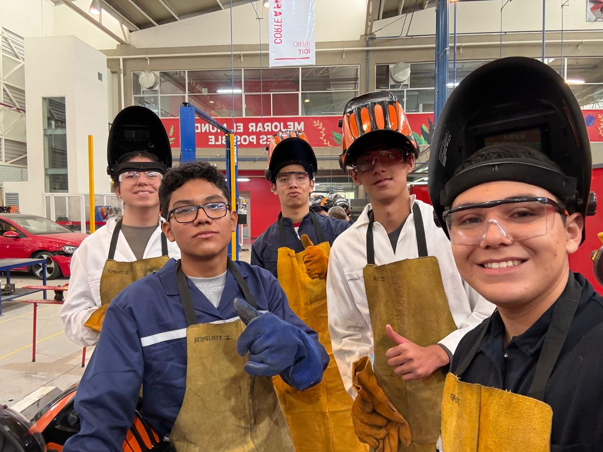{loading=lazy}
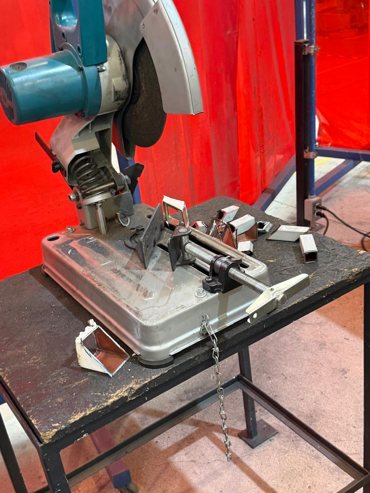{loading=lazy}
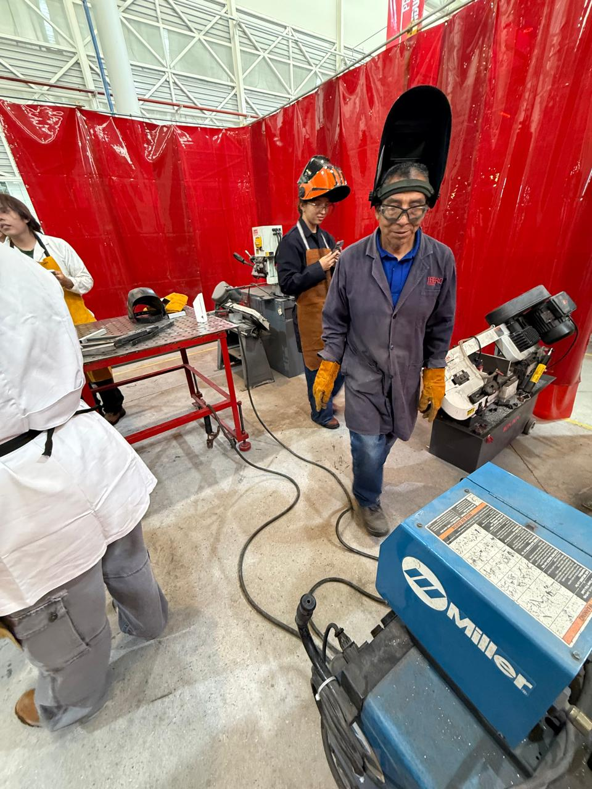{loading=lazy}
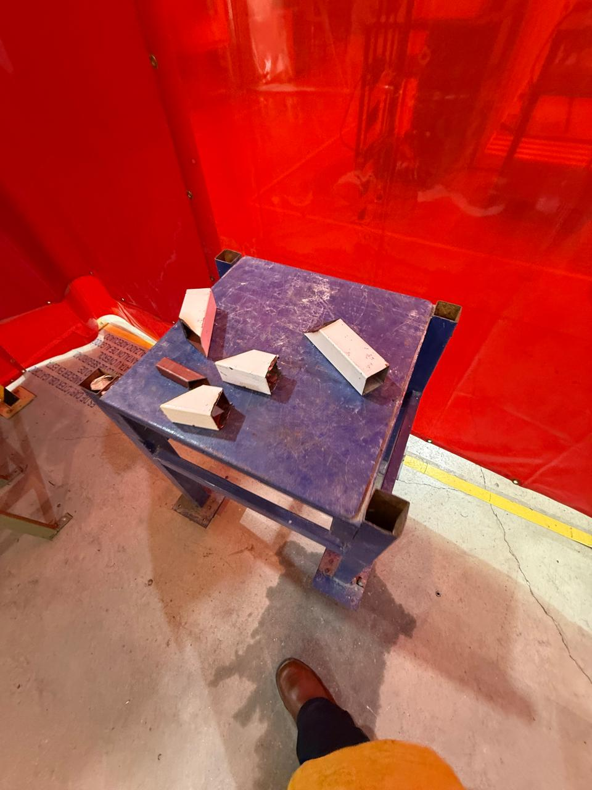{loading=lazy}
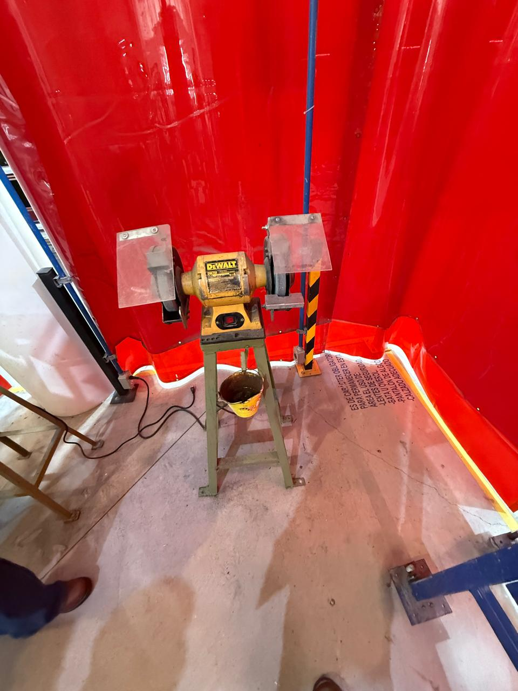{loading=lazy}
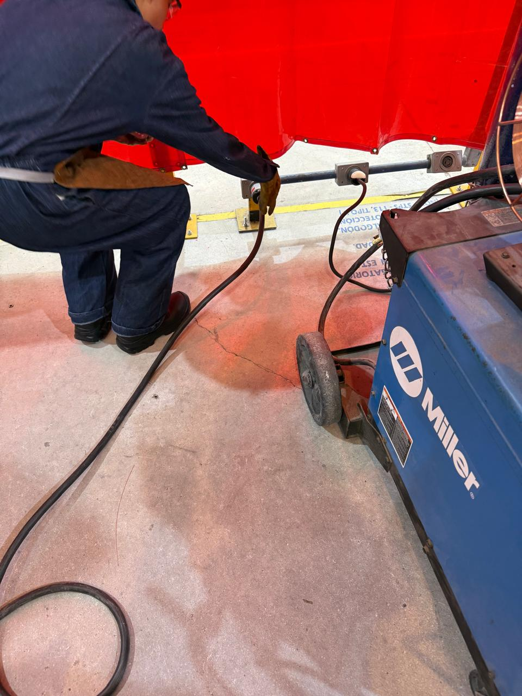{loading=lazy}
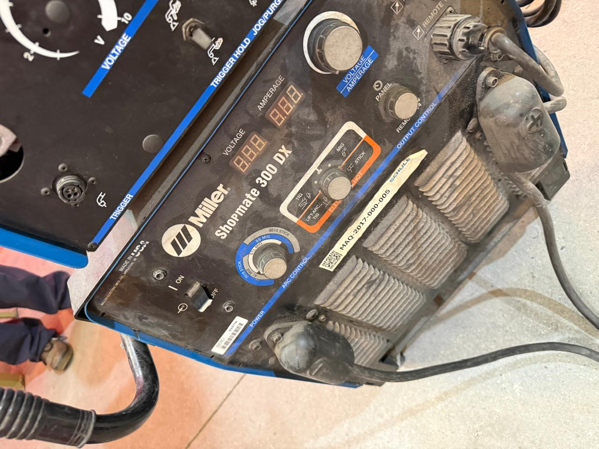{loading=lazy}
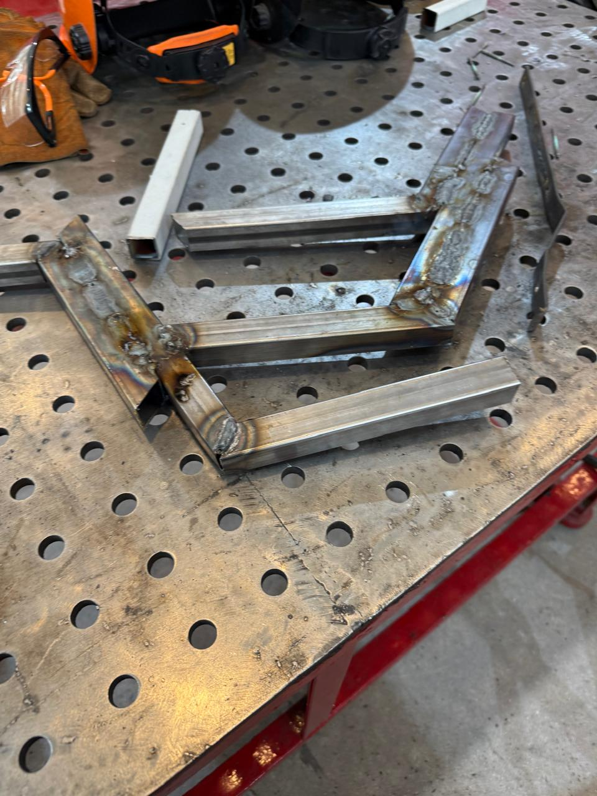{loading=lazy}
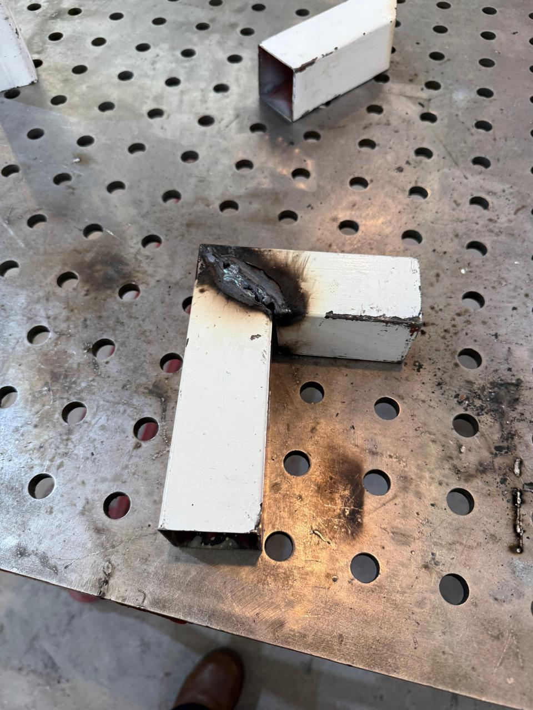{loading=lazy}

2. Reporte de práctica de diseño en SolidWorks

Esta vez, la clase comenzó en el salón designado para la materia de Proyecto de Ingeniería. Previamente, nuestro asesor nos había comentado que tendríamos que entregar un proyecto diseñado en SolidWorks, el cual consistiría en un objeto armable mediante piezas fabricadas con corte láser y que no necesitara ningún tipo de adhesivo o cinta para mantenerse estable. Por esta razón, el motivo principal de la clase era enseñarnos lo básico acerca de los diferentes tipos de uniones y piezas que podíamos utilizar para posteriormente construir nuestro propio diseño.

Antes de comenzar directamente con SolidWorks, primero tuvimos que realizar un boceto de nuestro diseño en una hoja aparte para tener una idea más clara de lo que queríamos construir y de la forma en la que se unirían las diferentes piezas. Una vez hecho esto, el maestro Oliver comenzó mostrándonos algunos de los ejemplos que ya se encontraban disponibles en nuestra plataforma de Teams. Entre estos había uniones bastante sencillas y otras con diseños un poco más complejos que incluso permitían distintos tipos de movimiento. La intención era que pudiéramos observar diferentes posibilidades y comprender mejor cómo una pieza podía ensamblarse con otra sin necesidad de utilizar algún tipo de adhesivo.

También nos explicó un poco acerca del funcionamiento de la cortadora láser, ya que sería la máquina que posteriormente utilizaríamos para fabricar nuestros diseños. Nos comentó que era necesario calibrarla correctamente para conseguir que los cortes quedaran lo mejor posible y que algunos de los parámetros principales que debíamos considerar eran:

La velocidad

La potencia

Dependiendo de cómo se configuraran estos valores y del material utilizado, el resultado del corte podía cambiar, por lo que era importante tenerlos en cuenta antes de comenzar a fabricar las piezas.

Después de lo ya mencionado, el maestro Oliver nos pidió que iniciáramos SolidWorks en las computadoras, ya que comenzaríamos a modelar uno de los tipos de unión más sencillos que aparecían en el material de Teams. Primero realizamos un rectángulo de centro y poco a poco fuimos dándole forma mediante herramientas que no habíamos utilizado anteriormente, como Matriz y Espejo. Personalmente, considero que estas herramientas facilitaron bastante el proceso, ya que permiten repetir o reflejar partes del diseño sin tener que realizarlas nuevamente de forma manual. De esta manera fuimos creando las diferentes pestañas y espacios que tendría nuestra pieza para que posteriormente pudiera unirse con otra. Finalmente, aprendimos a extruir utilizando regiones específicas hasta conseguir que nuestra primera pieza estuviera completamente terminada.

Una vez realizada la primera pieza, tuve que diseñar una segunda para completar la unión. Lógicamente, era necesario que ambas tuvieran medidas que coincidieran, ya que las pestañas de una debían entrar correctamente en los espacios de la otra. En esta parte tuve un pequeño problema debido a que, al momento de extruir una de las piezas, sus dimensiones se reducían más de lo necesario y ya no coincidían correctamente con las de la primera. Para solucionarlo tuve que modificar algunas medidas y agregar la diferencia que se estaba perdiendo hasta conseguir que las dos piezas tuvieran las dimensiones necesarias para poder ensamblarse correctamente.

Posteriormente, el maestro Oliver nos enseñó cómo realizar un armado dentro de SolidWorks. Para esto utilizamos diferentes archivos de piezas dentro de un mismo espacio de trabajo y fuimos haciendo coincidir sus partes dependiendo de la posición en la que se encontraban las uniones. De esta manera pudimos observar cómo quedarían las piezas una vez ensambladas antes de fabricarlas físicamente. También cambié los colores de las diferentes piezas para poder distinguirlas con mayor facilidad y entender mejor la posición que ocupaba cada una dentro del armado. Al final, fue posible formar una pequeña estructura utilizando las piezas que habíamos modelado previamente.

Como última parte de la clase, el maestro nos mostró cómo preparar nuestros archivos para llevarlos posteriormente a la cortadora láser. Para esto tuvimos que crear un plano de dibujo dentro de SolidWorks y colocar ahí las piezas que queríamos cortar. Algo importante que nos explicó fue que debíamos seleccionar correctamente la vista de cada pieza, ya que el programa permite colocarla desde diferentes planos y para el corte necesitábamos utilizar la cara adecuada. También fue necesario establecer una escala de 1:1 para conservar las dimensiones reales del diseño y evitar que las piezas terminaran con un tamaño diferente al que habíamos establecido originalmente.

Debido a que el corte láser se realiza utilizando el diseño de las piezas en dos dimensiones, en este mismo plano tuvimos que copiar y acomodar todas las piezas necesarias para formar nuestro objeto. El maestro hizo énfasis en que debíamos colocarlas lo más cerca posible entre sí y organizarlas de la mejor manera dentro del espacio disponible, ya que así se puede aprovechar una mayor cantidad del material y evitar desperdicios innecesarios. Una vez que todas las piezas estuvieran correctamente acomodadas, el archivo ya podía prepararse para llevarlo a la cortadora láser y realizar los cortes correspondientes.

Considero que esta clase fue bastante útil porque no solamente aprendimos nuevas herramientas de SolidWorks, sino que también comenzamos a relacionar el diseño realizado en computadora con la manera en la que posteriormente se puede fabricar una pieza real. Al principio algunas herramientas y medidas podían resultar un poco confusas, principalmente al momento de conseguir que las dos piezas coincidieran correctamente, pero solucionar este problema también me ayudó a comprender mejor la importancia de las dimensiones al diseñar una unión. Además, aprender a realizar el armado y preparar los archivos para el corte láser considero que será bastante útil para nuestro proyecto, ya que ahora tenemos una idea mucho más clara de cómo pasar de un boceto inicial a un diseño que realmente pueda ser fabricado y ensamblado.

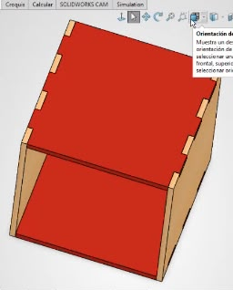{loading=lazy}
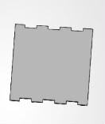{loading=lazy}
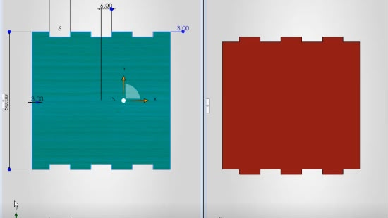{loading=lazy}
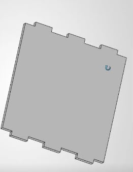{loading=lazy}
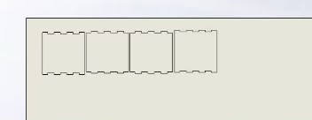{loading=lazy}

3. Reporte de práctica de corte láser en el IDIT

En la clase pasada, dedicada principalmente a trabajar y cuadrar nuestro diseño dentro de SolidWorks, el maestro Oliver nos comentó que posteriormente nos iría llamando en grupos de aproximadamente seis personas para enseñarnos a utilizar la máquina de corte láser. La intención era que, al momento de llevar el plano de nuestro propio proyecto, ya conociéramos los pasos básicos para encender, preparar y utilizar la máquina, de manera que pudiéramos realizar nuestros cortes correctamente y sin ningún riesgo. Por esta razón, esta práctica estuvo enfocada principalmente en aprender directamente el proceso que tendríamos que seguir cuando llegara nuestro turno de fabricar las piezas diseñadas en SolidWorks.

Una vez reunido nuestro grupo, el maestro Oliver comenzó mostrándonos la cortadora y explicándonos los primeros pasos que debíamos realizar antes de comenzar cualquier corte. Primero abrió la máquina para enseñarnos el espacio en el que se coloca el material y nos explicó que este debía llevarse hasta la esquina, procurando que quedara bien acomodado. Este paso era importante porque nos permitiría tener una referencia clara para saber desde qué punto comenzaríamos a trabajar y evitar que el láser iniciara fuera del material.

Después, el maestro nos mostró la cabeza del láser, que es la parte que se mueve dentro de la máquina y se encarga de realizar el corte. Nos enseñó que esta se podía desplazar utilizando los controles de la máquina hasta colocarla en la esquina del material, que sería nuestro punto de referencia para comenzar. Una vez ubicada correctamente, también nos explicó cómo calibrar el láser, ajustando la distancia entre la cabeza y la superficie del material para que pudiera realizar el corte de la mejor manera. Finalmente, se fijaba la posición de inicio para indicarle a la máquina desde qué punto debía comenzar a trabajar.

Posteriormente, continuó mostrándonos los controles necesarios para manejar la cortadora. En lugar de solamente explicarnos para qué servía cada botón, fue realizando el proceso paso por paso para que pudiéramos observar el orden que tendríamos que seguir nosotros después:

Se coloca correctamente el material en la esquina.

Se mueve la cabeza del láser hasta el punto donde se desea comenzar.

Se realiza la calibración necesaria.

Se fija esa posición como referencia.

Considero que esta fue una de las partes más importantes de la explicación, ya que un error al colocar el material, calibrar el láser o seleccionar el punto de inicio podría afectar el resultado del corte.

El maestro también nos mostró más de cerca la cabeza del láser y algunas de las partes que la rodean. Aunque no profundizamos demasiado en el funcionamiento de cada componente, esta explicación sirvió para reconocer mejor qué parte de la máquina se estaba moviendo cuando utilizábamos los controles. De esta manera, cuando posteriormente tengamos que realizar nuestros propios cortes, será más sencillo entender qué estamos modificando al mover la cabeza y por qué debemos colocarla y calibrarla correctamente antes de comenzar.

Una vez que la máquina estaba preparada, calibrada y con el punto de inicio establecido, pudimos observar cómo se realizaba el proceso de corte. Al comenzar, la cabeza del láser se movía automáticamente siguiendo la forma de las piezas que debía realizar. En este punto ya no era necesario moverla manualmente, debido a que la propia máquina seguía la información del archivo hasta terminar el trabajo. Al finalizar, el maestro abrió nuevamente la cortadora para revisar el resultado y comprobar que los cortes se hubieran realizado correctamente antes de retirar las piezas.

Hacia la parte final de la clase retomamos el tema del plano que habíamos trabajado anteriormente en SolidWorks. En la computadora pudimos observar cómo las diferentes piezas se encontraban acomodadas dentro del plano que posteriormente se utilizaría para realizar el corte. Esto también nos permitió entender mejor por qué en la clase anterior el maestro había hecho énfasis en colocar las piezas lo más cerca posible entre sí, mantenerlas en escala 1:1 y seleccionar la vista correcta, ya que de esta manera se aprovecha mejor el espacio disponible y las piezas mantienen las medidas con las que fueron diseñadas.

Esta última parte ayudó a relacionar mucho mejor las dos clases. En la anterior nos habíamos concentrado en diseñar las piezas, realizar sus uniones, comprobar el armado y acomodarlas correctamente dentro del plano de SolidWorks. En esta ocasión aprendimos qué sucede después de tener listo ese archivo y cuáles son los pasos que tendremos que seguir para utilizar la cortadora. De esta manera, ya tenemos una idea más completa del proceso que comienza con el diseño en computadora y termina con las piezas cortadas físicamente.

Considero que esta práctica fue bastante útil, principalmente porque no nos limitamos únicamente a observar cómo funcionaba la cortadora láser, sino que el maestro Oliver nos explicó de una manera sencilla el proceso que tendremos que seguir cuando nos toque utilizarla. Aprendimos que primero debemos colocar correctamente el material en la esquina, después mover la cabeza del láser hasta el punto donde queremos comenzar, calibrar correctamente el láser, fijar esa posición como referencia y finalmente iniciar el trabajo una vez que todo esté preparado. El hecho de realizar esta explicación en grupos pequeños también facilitó observar cada paso de cerca y entender mejor el procedimiento. Personalmente, considero que ahora tengo una idea mucho más clara de cómo utilizar la máquina y me siento más familiarizado con el proceso que tendremos que realizar cuando llegue el momento de cortar las piezas de nuestro propio proyecto.

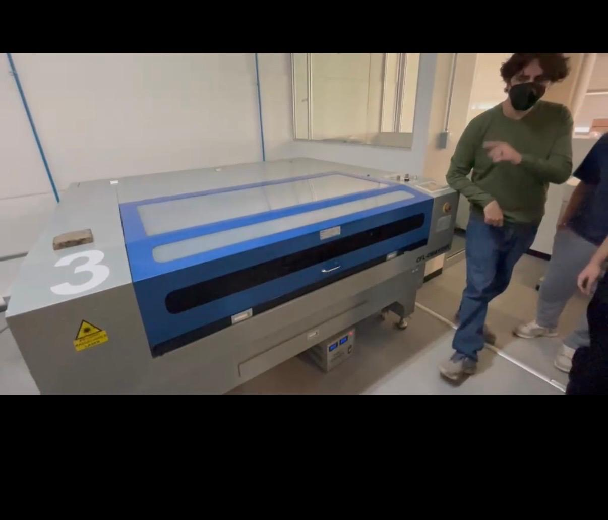{loading=lazy}
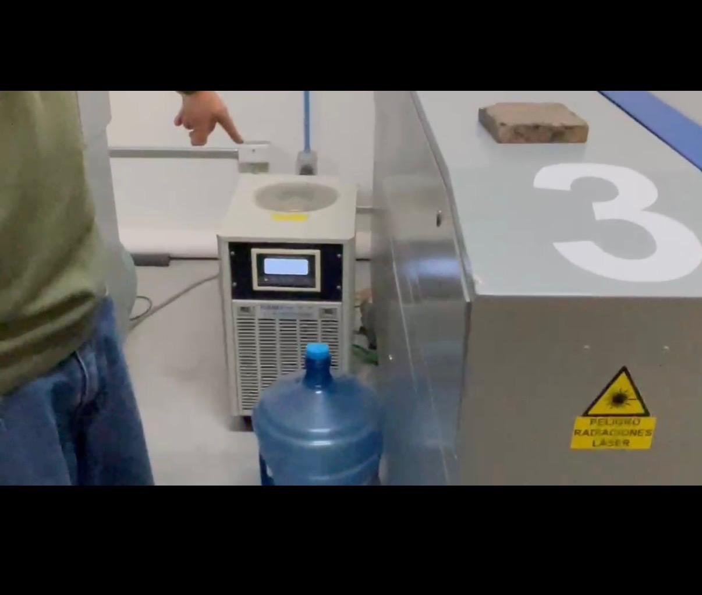{loading=lazy}
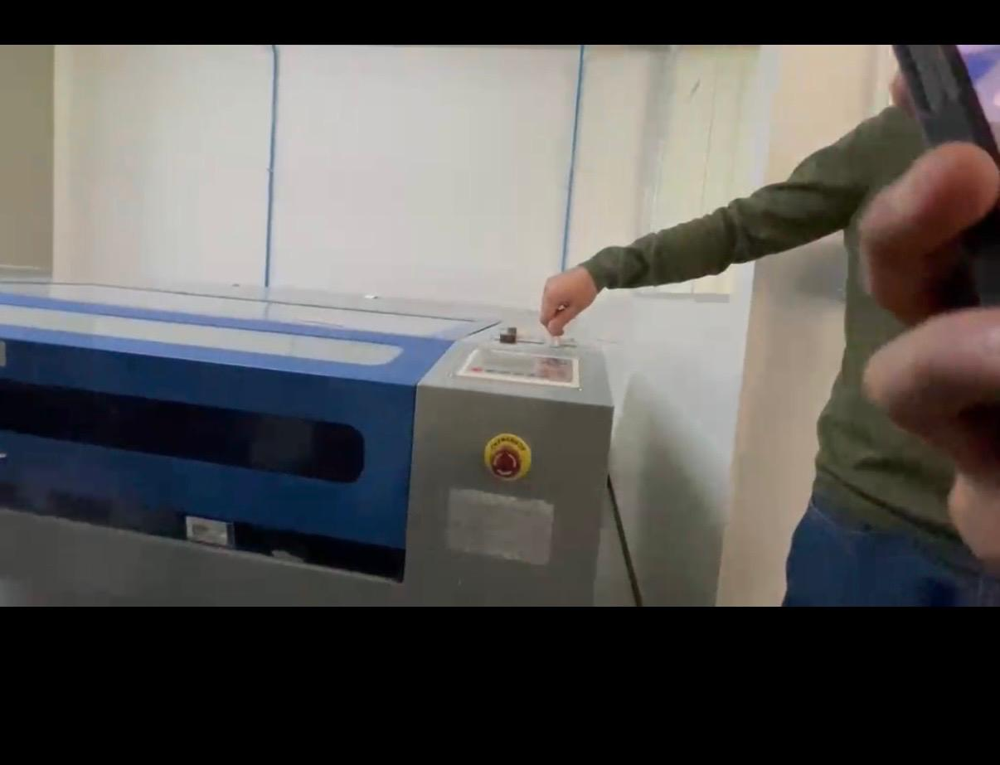{loading=lazy}
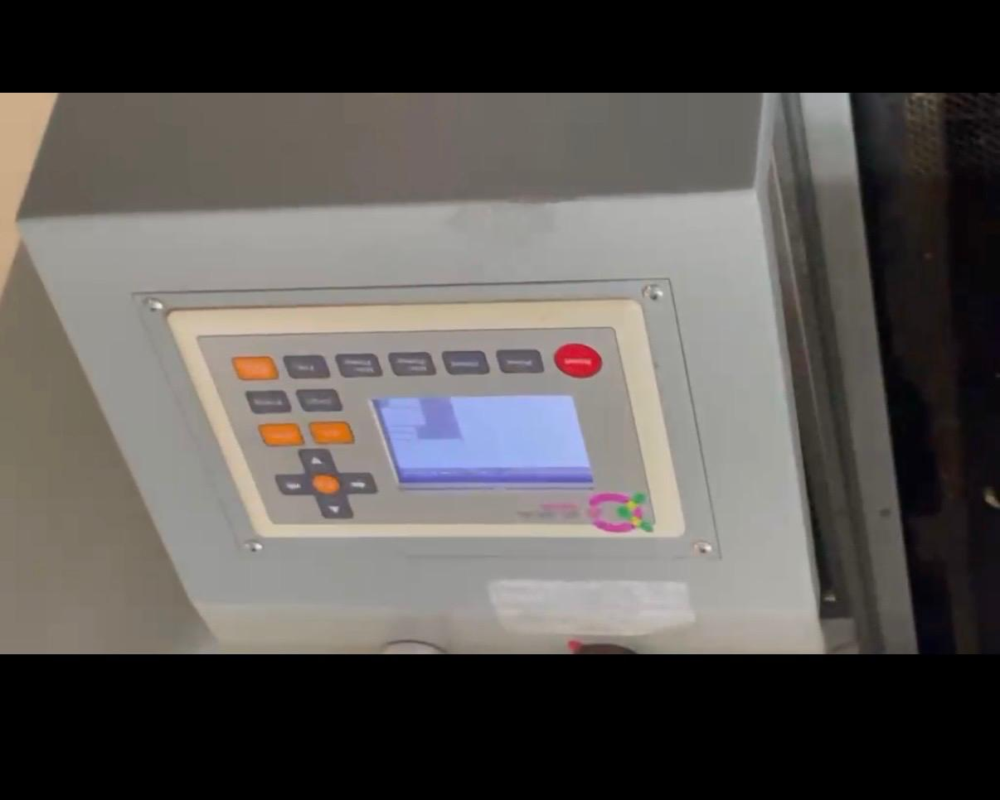{loading=lazy}
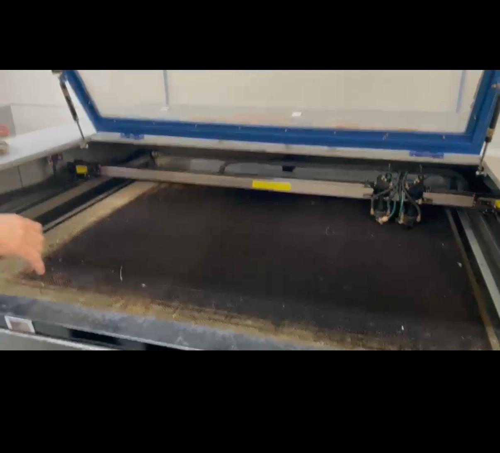{loading=lazy}
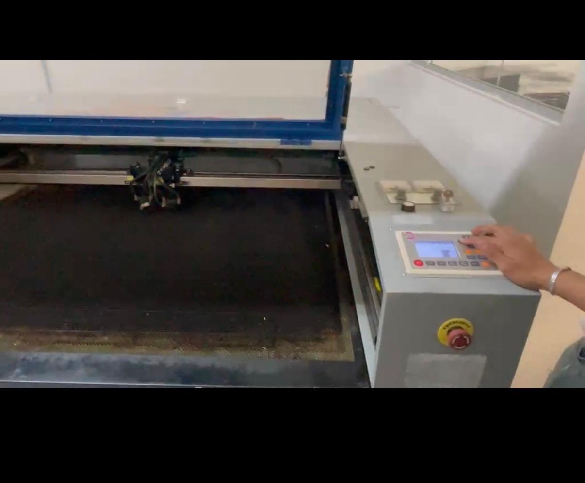{loading=lazy}
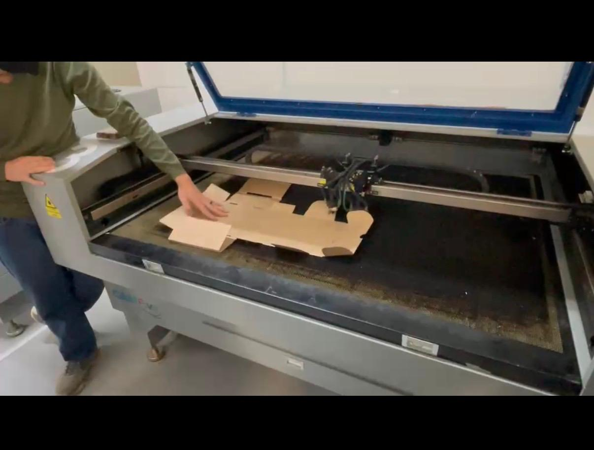{loading=lazy}
