# Proyecto de Ingeniería I
---

## Reporte 1: Soldadura, corte con sierra y esmerilado

La clase tuvo lugar dentro del IDIT, en la sección para corte y soldadura. Para ella el profesor nos pidió llevar bata y botas industriales, ya que las actividades que íbamos a hacer tenían el riesgo de poder ocasionarnos algún accidente.

Empezando la clase el profesor nos presentó al señor Cholula, quien nos explicó algunas reglas de seguridad que debíamos seguir en todo momento, después de esto el profesor y el señor Cholula nos pidieron ir al almacén a pedir piezas de equipo que necesitábamos, por nuestra seguridad, estos fueron:

- Careta para soldar
- Pechera de cuero
- Guantes
- Lentes de seguridad

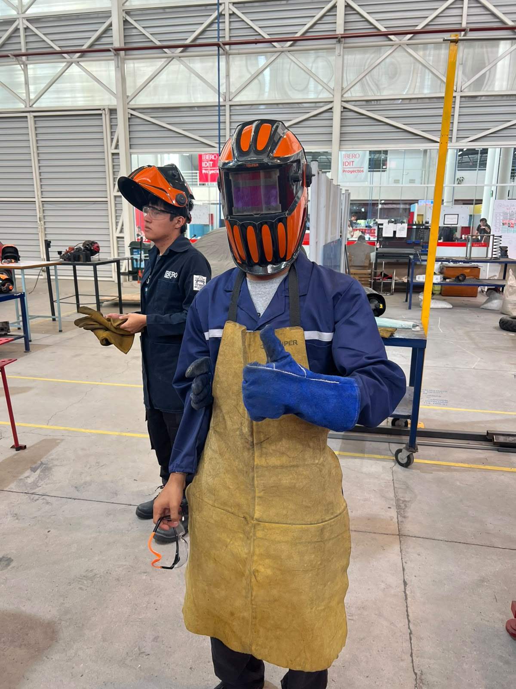{loading=lazy}

Una vez teniendo este equipo, nos pusimos alrededor de la mesa en donde estaba el señor Cholula para que nos diera la demostración de cómo se debe de soldar, pero primero nos dijeron tanto el señor Cholula como el profesor que antes de empezar a soldar debemos de tener puestas las caretas y corroborar que todos los que están alrededor la tengan de igual manera.

Primero, la máquina para soldar se conecta y se enciende, se comprueba la energía con la que vayamos a soldar (en este caso fue un poco baja ya que era nuestra primera vez), después se conecta una de las pinzas a la mesa para que haga de tierra, la segunda pinza toma una vara para soldar, esta vara se acerca al metal y se empieza a soldar, debe de estar a una distancia un poco corta del material aunque sin tocarlo y se debe de mover de manera un poco lenta y constante para que la soldadura salga bien.

Fuimos pasando uno a uno a intentar soldar con la guía del señor Cholula, y una vez hayamos pasado podíamos pasar a la otra mesa con el profesor para poder intentar soldar nosotros solos.

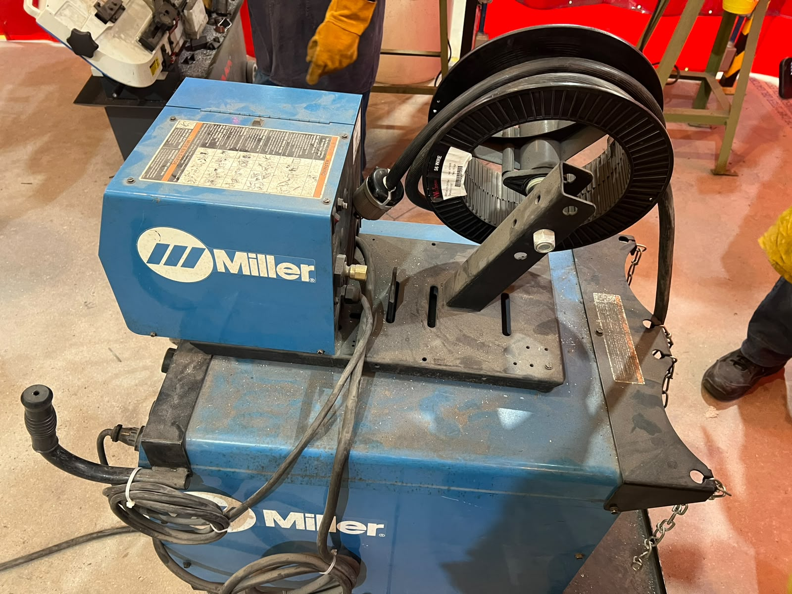{loading=lazy}

Una vez terminamos de soldar, nos tocó aprender a como ocupar las sierras que están ahí mismo, el profesor nos dijo que estas sierras funcionan como lijas y que no tienen tanto riesgo a la hora de usarlas. Para esta actividad ya nos pudimos quitar las caretas, pero debíamos de tener los lentes de seguridad para proteger nuestros ojos.

Para usarlas primero se debe de apretar el material de modo que no se pueda mover de su lugar, después se debe de presionar el botón superior seguido del botón inferior en el mango de la sierra para poder encenderla, y por último se debe de bajar con velocidad constante hasta cortar completamente el material. Se levanta la sierra y se sueltan los botones, pero no se debe de quitar la mano del mango hasta que se detenga la sierra.

En las sierras hicimos cortes de una barra de metal, en una sierra verticalmente y en la otra a 45°.

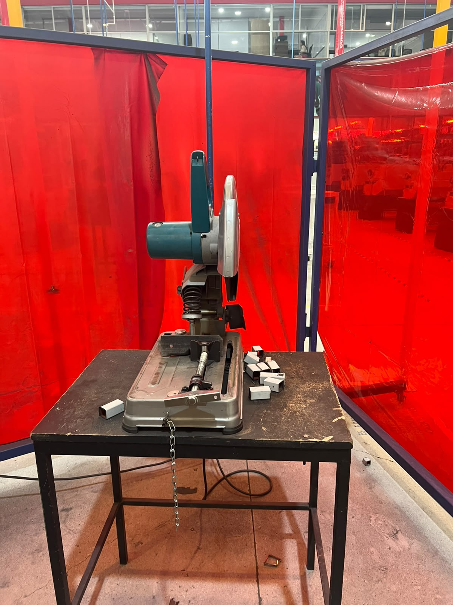{loading=lazy}
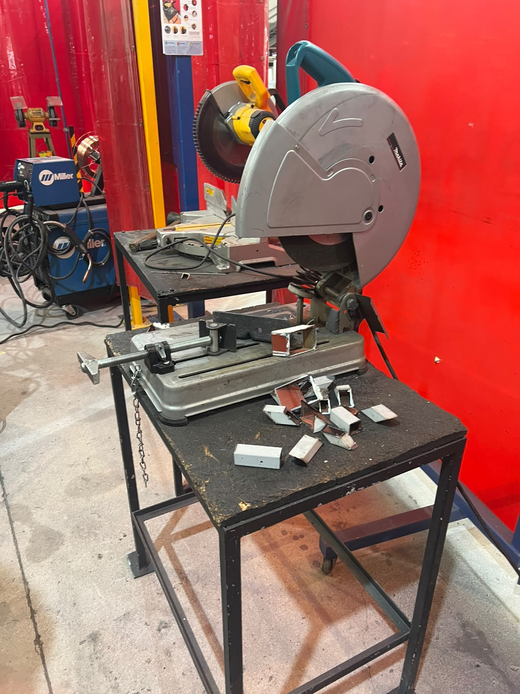{loading=lazy}
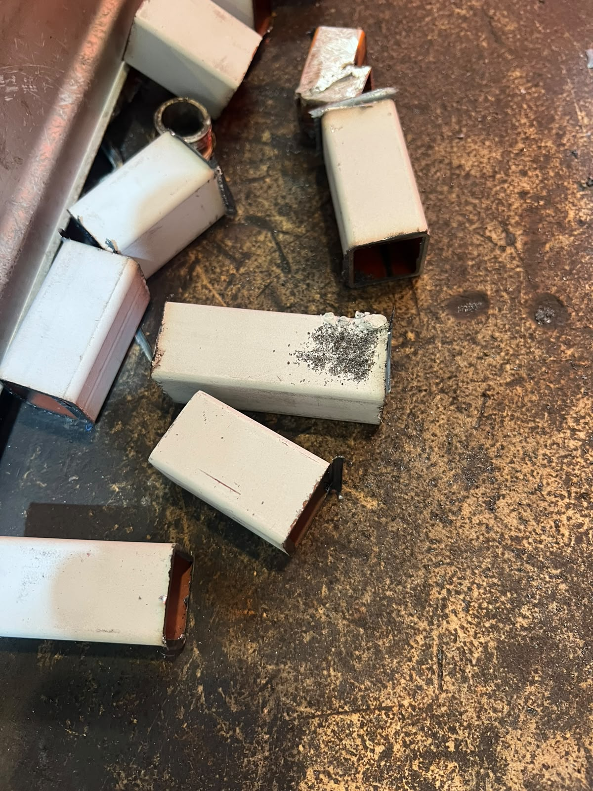{loading=lazy}

Por último, con las piezas que acabábamos de cortar aprendimos a usar la piedra para esmerar, en la que se quitan las imperfecciones que le quedan al material después de cortarlo.

Ahí mismo está la máquina para esmerar, que se enciende y debes de apoyar la pieza contra el soporte al ángulo en el que quieres quitar las imperfecciones, pegarlo a la piedra y moverlo un poco lento y a velocidad constante hasta retirar las imperfecciones.

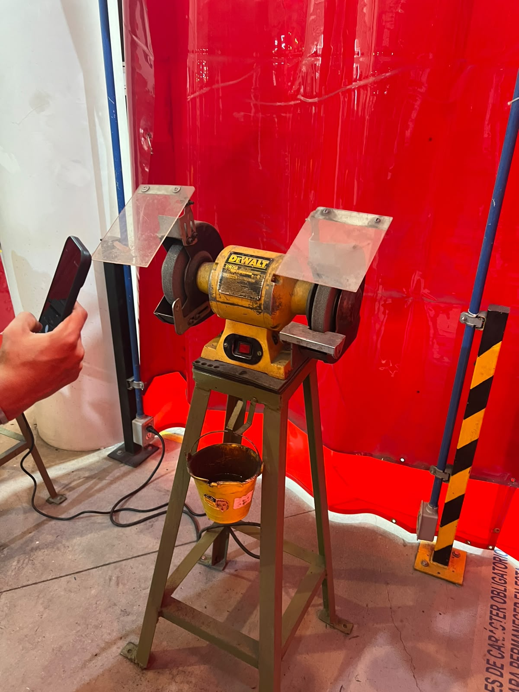{loading=lazy}

Al final de la clase, entre todos soldamos 2 pedazos de metal a un ángulo de 90°, midiéndolo con la escuadra.
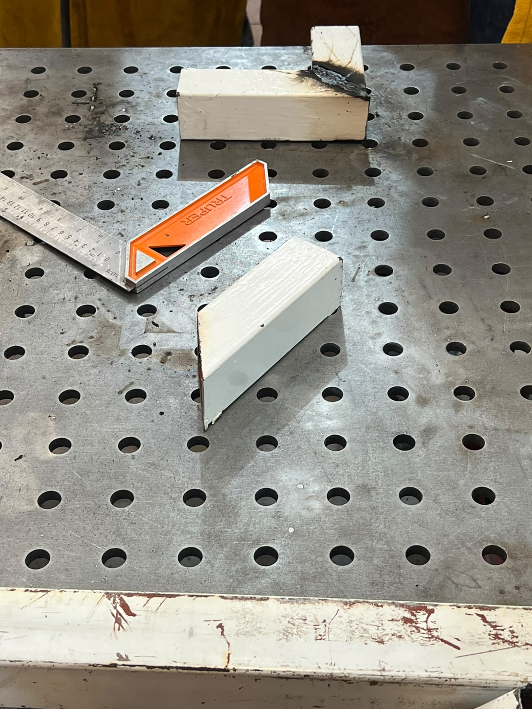{loading=lazy}

---

## Reporte 2: Ensamble en SolidWorks

Empezando la clase el profesor nos enseñó un sitio web donde podíamos ver unos ensamblajes que sus alumnos habían hecho, además de algunas técnicas para poder hacer el material “flexible” con corte laser. Después nos puso la consigna de cómo podríamos hacer un ensamblaje de un cubo, después de pensarlo un poco surgió la idea de hacerlo conectando las caras con dientes salientes de cada cara, hicimos un boceto en Paint para poder visualizar mejor que querríamos hacer, después de llegar a la idea final pasamos a modelarlo a SolidWorks, en la sección de pieza realizamos las caras por separado y, al terminarlas, el profesor nos enseñó la herramienta de ensamblaje, en donde pudimos meter en un mismo plano todas las caras que hicimos y como agrupar las caras para evitar que estas se muevan por el plano y ver si de verdad se ensamblarían de buena manera, lo cual logramos, sin embargo falto el añadir la tolerancia por Kerf, que es el material que se “come” la cortadora laser al momento de ocuparla, y al corregirlo quedamos con el ensamble del cubo.

---

## Reporte 3: Cortadora Laser

Ya que durante horario de clase la cortadora laser no estaba disponible, fuimos otro día en grupos de 6 personas a que el profesor nos enseñara como se ocupaba, una vez llegando nos explicó los pasos para poder usarla:

* **Encenderla:**
  1. Encender el switch debajo de la cortadora y esperar a que suene
  2. Revisar si el enfriador está encendido y tiene agua (Si no enciende o no tiene agua apagar inmediatamente)
  3. Encender el switch al costado de la maquina
  4. Quitar el paro de emergencia girándolo
  5. Ingresar y girar la llave del profesor

* **Usarla:**
  1. Con las flechas del tablero mover el laser y definir el centro
  2. Colocar el material
  3. Calibrar el láser (5mm)
  4. Cerrar la maquina
  5. Encender el laser
  6. Abrir el programa en la computadora (USB requerida)
  7. Colocar el diagrama de lo que se quiere cortar
  8. Definir escala del corte y, potencia y velocidad del laser
  9. Probar la zona en la que se va a cortar y corroborar que está bien
  10. Cortar

  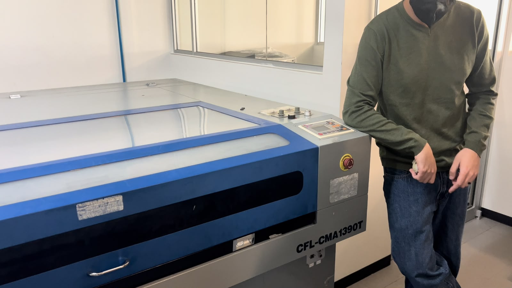{loading=lazy}
  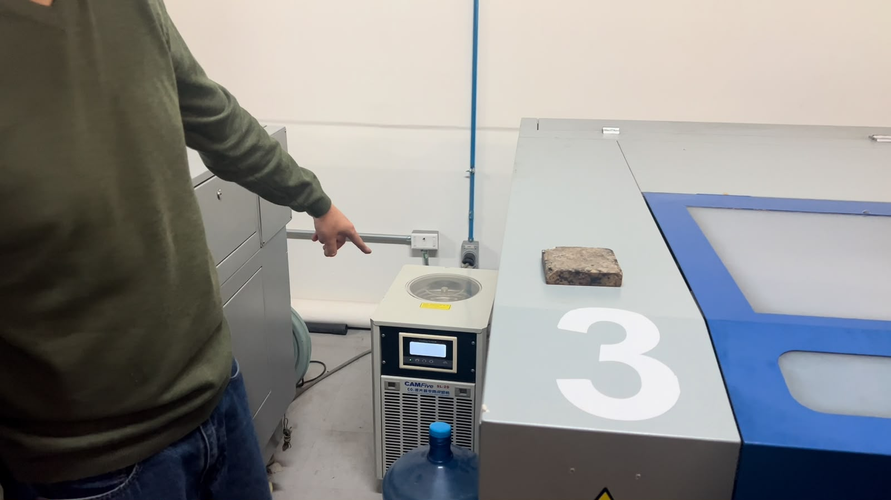{loading=lazy}
  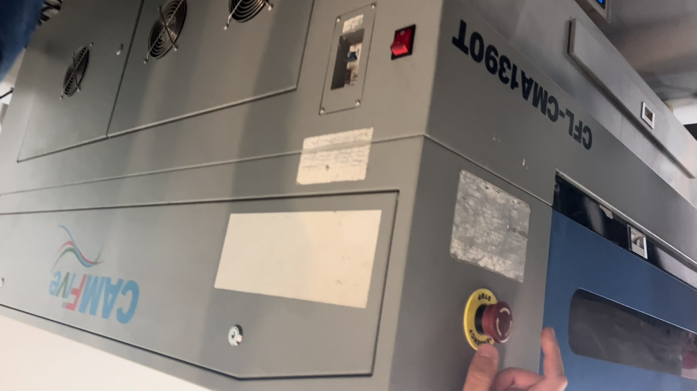{loading=lazy}
  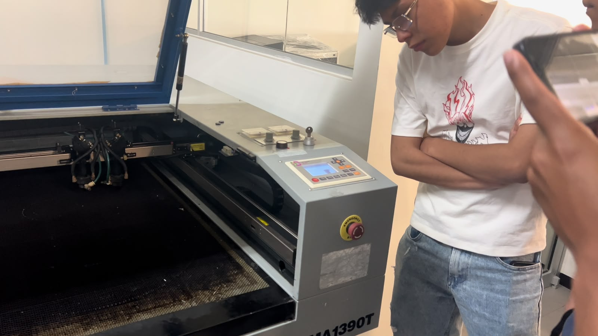{loading=lazy}
  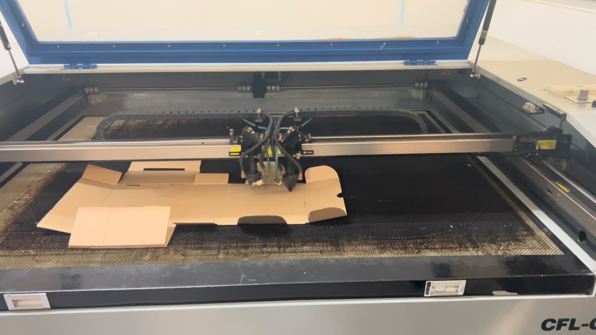{loading=lazy}