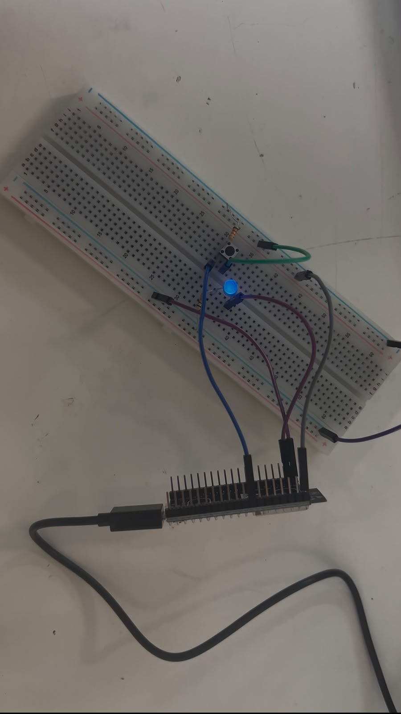
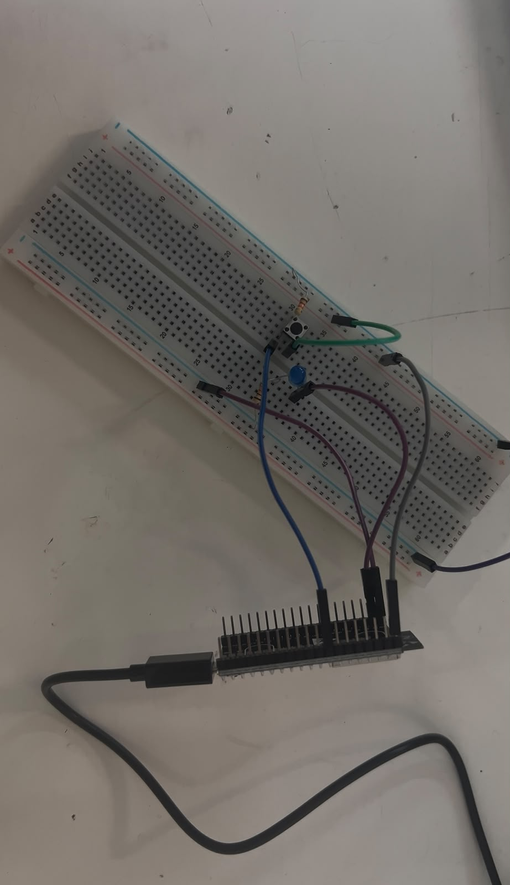
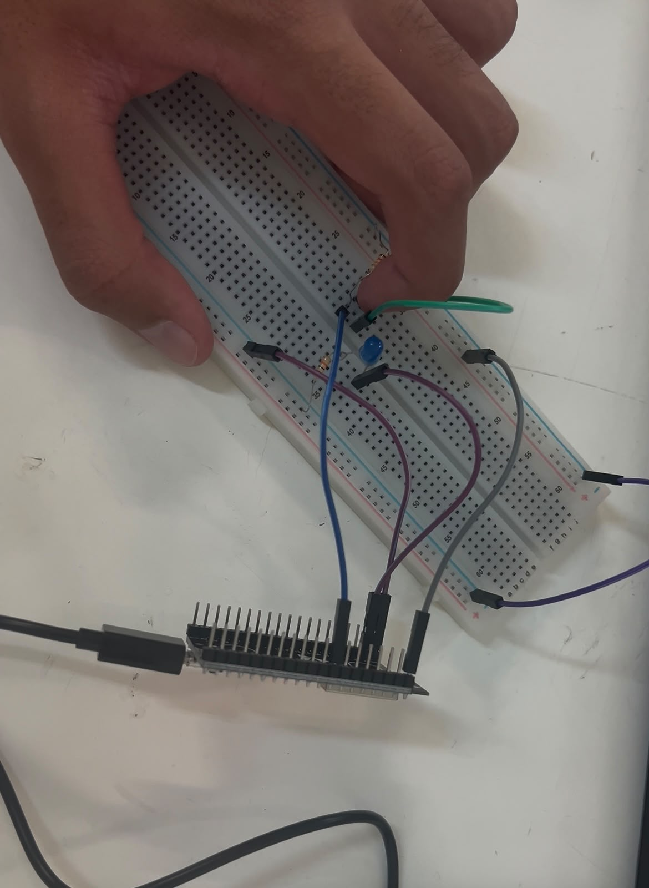
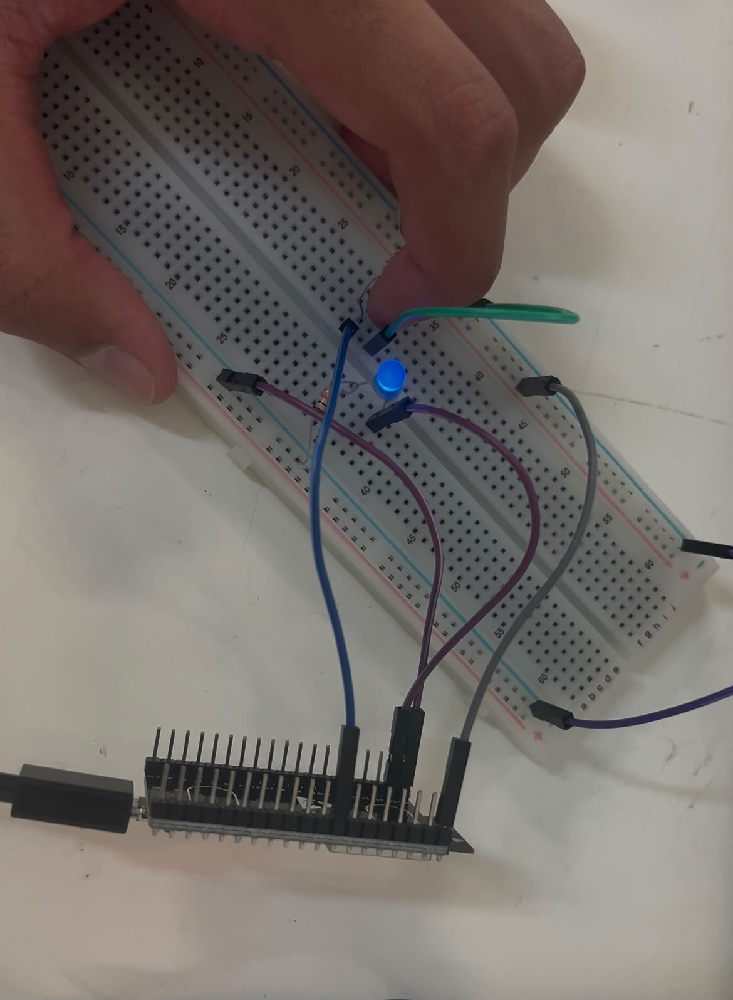
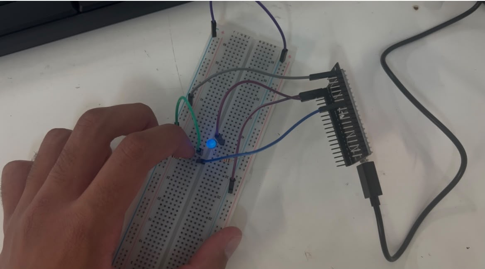
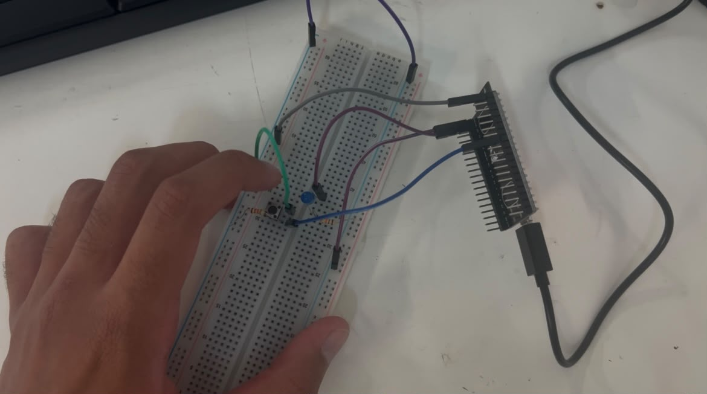

# Reporte de Práctica: ESP32 

**Universidad Iberoamericana Puebla**  
**Materia:** Introducción a la Mecatrónica  
**Tema:** MCU101 — ESP32

---

## 1. Metas y Propósitos de la Práctica

### Objetivos
* **BLINK (salida digital):** LED externo parpadeando a 1 Hz.
* **BLINK con botón (entrada digital):** El LED enciende mientras el botón está presionado (`INPUT_PULLUP`).
* **TOGGLE con antirrebote:** Cada presión del botón alterna el estado del LED (sin usar `delay()`).
* **EXTRA (Contador con/sin antirrebote):** 
  * Programar un contador de presiones sin antirrebote.
  * Presionar 10 veces e imprimir en consola el resultado.
  * Activar el antirrebote y repetir la prueba.

---

## 2. Componentes y Materiales Utilizados

| Cantidad | Componente / Material |
| :---: | :--- |
| 1× | ESP32 DevKit V1 (WROOM-32) |
| 1× | Cable USB de datos |
| 1× | LED + (1×) Resistor 220 Ω |
| 1× | Push button |
| 1× | Resistor 10 kΩ *(opcional)* |
| — | Protoboard y jumpers |

---

## 3. Desarrollo de la Práctica

### BLINK — Salida digital
Para comenzar, conectamos un LED externo al Pin23 de la ESP32 y realizamos un programa sencillo para hacerlo parpadear a una frecuencia de 1 Hz. Con este primer ejercicio comprobamos el funcionamiento de una salida digital y el control del LED desde Arduino IDE.

En nuestro montaje observamos que el LED respondía de manera invertida, es decir, con `LOW` se encendía y con `HIGH` se apagaba. Este comportamiento se tomó en cuenta en los siguientes ejercicios para que el circuito funcionara de la manera esperada.

### BLINK con botón — Entrada digital
Después agregamos un botón conectado al Pin33 y utilizamos `INPUT_PULLUP` para leer su estado. En nuestro ejercicio, cuando el botón estaba libre se obtenía una lectura `HIGH`, mientras que al presionarlo cambiaba a `LOW`. Esto ocurría porque al presionar el botón el pin se conectaba a GND.

Este funcionamiento coincidió con la lógica utilizada para controlar nuestro LED: al presionar el botón se obtenía `LOW` y el LED se encendía, mientras que al soltarlo se obtenía `HIGH` y el LED se apagaba. De esta manera logramos que el LED permaneciera encendido únicamente mientras el botón estaba presionado.

### TOGGLE con antirrebote
Posteriormente modificamos el funcionamiento para que cada presión del botón alternara el estado del LED. De esta forma, una presión lo encendía y la siguiente lo apagaba.

También implementamos un antirrebote de 30 ms, sin utilizar `delay()`. Esto permitió evitar que los pequeños cambios producidos por el botón fueran interpretados como varias pulsaciones. Para el control del LED se mantuvo la misma lógica observada durante el montaje, utilizando `LOW` para encenderlo y `HIGH` para apagarlo.

---

## 4. Explicación del Funcionamiento

### a. ¿Qué es el rebote de un botón?
El rebote ocurre cuando presionamos o soltamos un botón y sus contactos internos generan varios cambios muy rápidos antes de quedar en un estado estable. Aunque nosotros realizamos una sola presión, la ESP32 puede detectar estos pequeños cambios como si hubiéramos presionado el botón varias veces.

Por esta razón se utiliza el antirrebote (*debounce*), ya que permite ignorar esos cambios rápidos y reconocer de una manera más estable cada pulsación.

### b. ¿Por qué con `INPUT_PULLUP` la lógica queda invertida?
Al utilizar `INPUT_PULLUP`, la resistencia interna conecta el pin a $V_{CC}$, por lo que el pin permanece en `HIGH` mientras el botón no está presionado. Cuando lo presionamos, el pin se conecta a GND y la lectura cambia a `LOW`. Por esta razón, en nuestro ejercicio el botón libre correspondía a `HIGH` y el botón presionado a `LOW`.

En nuestro montaje, esto coincidió con el funcionamiento del LED, ya que `LOW` lo encendía y `HIGH` lo apagaba. Por lo tanto, al presionar el botón obteníamos `LOW` y el LED encendía, mientras que al soltarlo obteníamos `HIGH` y el LED se apagaba. Así pudimos observar directamente el funcionamiento de esta lógica durante la práctica.

---

## 5. Punto Extra: Contador con/sin Antirrebote

Para el punto extra realizamos un contador de presiones y observamos los resultados directamente en el Monitor Serial de Arduino IDE. El propósito fue comparar qué ocurría al utilizar el botón sin antirrebote y después al implementar esta función, tal como se solicita en la presentación.

* **Sin antirrebote:**  
  Primero utilizamos el contador sin antirrebote y realizamos 10 presiones. Durante esta prueba pudimos observar claramente el efecto del rebote, ya que una sola presión llegaba a aumentar varias veces el contador. Esto permitió comprobar de manera práctica que los pequeños cambios producidos por el botón sí pueden afectar la lectura realizada por la ESP32.

* **Con antirrebote:**  
  Después activamos el antirrebote y repetimos las 10 presiones. En esta ocasión el conteo fue mucho más estable, evitando que una sola pulsación aumentara varias veces el contador. La comparación entre ambas pruebas nos permitió entender de manera más clara la utilidad del antirrebote y por qué es importante cuando se trabaja con botones físicos.

---

## 6. Bitácora de Errores

| Síntoma | Cómo lo encontré | Solución |
| :--- | :--- | :--- |
| No se presentaron fallas durante el armado del circuito. | Fuimos comprobando el funcionamiento conforme realizábamos cada ejercicio. | No fue necesario modificar el armado, ya que las conexiones funcionaron correctamente desde la primera prueba. |

> **Nota:** El funcionamiento con `LOW` y `HIGH` observado durante los ejercicios no se consideró una falla, ya que el circuito respondió correctamente y esta condición simplemente se tomó en cuenta al momento de realizar los códigos.

---

## 7. Conclusiones

Con esta práctica logramos comprender de una forma más clara cómo funcionan las entradas y salidas digitales de la ESP32. Comenzamos haciendo parpadear un LED y después agregamos un botón para controlar su funcionamiento. Durante estos ejercicios observamos directamente la lógica utilizada con `INPUT_PULLUP`: cuando el botón estaba libre obteníamos `HIGH` y al presionarlo cambiaba a `LOW`. En nuestro montaje esto coincidió con el funcionamiento del LED, ya que `LOW` lo encendía y `HIGH` lo apagaba, por lo que fue importante considerar estos estados al momento de programar.

La parte del antirrebote también fue importante porque pudimos observar su utilidad de manera práctica. Con el contador del punto extra vimos que, sin antirrebote, una sola presión podía registrarse varias veces, mientras que al implementarlo el conteo se volvió mucho más estable. En general, la práctica nos permitió relacionar de mejor manera el código realizado en Arduino IDE con el comportamiento real de los componentes conectados a la ESP32.

---

## 8. Evidencias de Entrega (Portafolio)

* **Evidencia 1. Códigos implementados con comentarios:** Capturas de pantalla de los códigos realizados en Arduino IDE.
{loading=lazy}
{loading=lazy}
{loading=lazy}
{loading=lazy}
{loading=lazy}

* **Evidencia 2. Esquemáticos:** Diagramas correspondientes a las conexiones utilizadas con la ESP32.

{loading=lazy}
{loading=lazy}
{loading=lazy}
{loading=lazy}
{loading=lazy}
{loading=lazy}

* **Evidencia 3. Videos de funcionamiento:** Videos donde se observe el funcionamiento de BLINK, BLINK con botón y TOGGLE con antirrebote.
* **Evidencia 4. Punto extra sin antirrebote:** Captura del Monitor Serial donde se observe cómo una misma presión puede registrarse varias veces.

{loading=lazy}
{loading=lazy}
* **Evidencia 5. Punto extra con antirrebote:** Captura del Monitor Serial donde se observe un conteo más estable después de implementar el antirrebote.
{loading=lazy}
{loading=lazy}

*Estas evidencias corresponden a los códigos, esquemáticos, videos, explicaciones, reporte de fallas y conclusiones solicitados como entregables de la práctica.*

*Se uso IA para darle formato a la practica y un tono mas formal a la misma*