# Reporte de Práctica: Motor DC, Puente H y PWM

**Universidad Iberoamericana Puebla**  
**Materia:** Introducción a la Mecatrónica  
**Tema:** Actuadores101 — Motor DC, Puente H y PWM  
**Periodo:** Otoño 2026

---

## 1. Metas y Propósitos de la Práctica

### Objetivo

**Dirección y velocidad (motor DC):**

- Motor gira en ambos sentidos controlado por IN1/IN2.
- Control de velocidad por PWM, mínimo 3 velocidades distintas.
- Identifica el PWM mínimo de arranque del motor.

**Prueba de carga:**

- Mide corriente en arranque y en giro libre, con el multímetro conectado en serie.
- Compara ambos valores: ¿cuál es mayor y por qué?

**Servo:**

- Demuestra 3 posiciones: 0°, 90° y 180°.
- Muestra el cálculo de duty para cada una.

---

## 2. Componentes y Materiales Utilizados

| Cantidad | Componente |
|:---:|---|
| 1× | ESP32 DevKit V1 |
| 1× | Driver TB6612 (puente H) |
| 1–2× | Motor DC TT con caja reductora |
| 1× | Servo SG90 (o similar) |
| 1× | Potenciómetro 10 kΩ |
| — | Fuente/batería para motores (separada del ESP32, GND común) |
| 1× | Multímetro |
| — | Protoboard y jumpers |

Los materiales se mantienen de acuerdo con lo indicado en la presentación de la práctica.

---

## 3. Desarrollo de la Práctica

Durante esta práctica trabajamos con motores DC y servomotores para conocer diferentes maneras de controlar su movimiento. Primero realizamos las conexiones necesarias para los motores y utilizamos el puente H para hacerlos girar en ambos sentidos.

Después utilizamos PWM para controlar la velocidad de los motores. Se consideró un **PWM mínimo de arranque aproximado de 70** y se trabajó con tres velocidades diferentes: **80 para velocidad baja, 160 para velocidad media y 255 para velocidad alta**. Los motores se probaron de manera individual en cada velocidad y posteriormente se realizó el mismo procedimiento en el sentido contrario.

También utilizamos el multímetro conectado en serie para observar la corriente del motor. Finalmente, trabajamos con dos servomotores y los programamos para cambiar entre las posiciones de **0°, 90° y 180°**.

---

## 4. Resultados

Los principales resultados obtenidos durante la práctica fueron los siguientes:

| Prueba | Resultado |
|:---|:---:|
| PWM mínimo de arranque | ≈ 70 |
| Velocidad baja | PWM 80 |
| Velocidad media | PWM 160 |
| Velocidad alta | PWM 255 |
| Corriente de arranque | ≈ 120 mA |
| Corriente en giro libre | ≈ 75 mA |
| Posición servo 1 | 0°, 90° y 180° |
| Posición servo 2 | 0°, 90° y 180° |

El valor de **75 mA** corresponde aproximadamente a lo observado durante el giro libre. Debido a que fue difícil observar el momento exacto del arranque en la simulación, se tomó como referencia un valor aproximado de **120 mA** para la corriente de arranque.

La corriente de arranque es mayor porque el motor necesita más corriente para comenzar a moverse. Una vez que ya está girando de manera estable y sin carga, la corriente disminuye.

---

## 5. Cálculo del Duty Cycle

Para las posiciones de los servomotores también se calculó el duty cycle. La presentación utiliza un periodo de **20 ms** y pulsos de aproximadamente **1 ms, 1.5 ms y 2 ms** para las tres posiciones trabajadas.

La fórmula utilizada es:

$$
Duty(\%)=\frac{T_{HIGH}}{T}\times100
$$

### Para 0°

$$
Duty=\frac{1\,ms}{20\,ms}\times100
$$

$$
\boxed{Duty=5\%}
$$

### Para 90°

$$
Duty=\frac{1.5\,ms}{20\,ms}\times100
$$

$$
\boxed{Duty=7.5\%}
$$

### Para 180°

$$
Duty=\frac{2\,ms}{20\,ms}\times100
$$

$$
\boxed{Duty=10\%}
$$

Por lo tanto:

| Posición | Pulso | Duty |
|:---:|:---:|:---:|
| 0° | 1 ms | 5 % |
| 90° | 1.5 ms | 7.5 % |
| 180° | 2 ms | 10 % |

---

## 6. Explicación con Nuestras Palabras

Durante la práctica pudimos observar que el puente H permite controlar el sentido de giro de un motor cambiando el estado de sus entradas. Además, mediante PWM podemos modificar su velocidad utilizando diferentes valores. En nuestro caso trabajamos con tres niveles para distinguir fácilmente una velocidad baja, media y alta.

También observamos que la corriente que utiliza el motor puede cambiar dependiendo del momento de funcionamiento, siendo mayor durante el arranque que durante el giro libre. Por otro lado, con los servomotores pudimos controlar posiciones específicas de **0°, 90° y 180°**, lo que nos permitió conocer otra forma de controlar el movimiento de un actuador.

---

## 7. Reporte de Fallas

Durante la práctica no tuvimos una falla como tal en los componentes. Sin embargo, al realizar la simulación en **Tinkercad**, el circuito no funcionó de la manera esperada.

| Síntoma | Cómo la encontramos | Solución |
|---|---|---|
| Los motores en Tinkercad no respondían de la manera esperada. | Revisamos el circuito con ayuda de la profesora y observamos que algunas conexiones no estaban acomodadas correctamente. | Con ayuda de la profesora corregimos el acomodo de los cables y continuamos con la práctica. |

Esta situación nos ayudó a entender la importancia de revisar tanto el código como las conexiones cuando un circuito no funciona de la manera esperada.

---

## 8. Conclusiones

Esta práctica nos permitió comprender mejor el funcionamiento de los motores DC y los servomotores. Aprendimos a cambiar el sentido de giro de un motor, controlar diferentes velocidades mediante PWM y observar la diferencia entre la corriente de arranque y la corriente durante el giro libre.

Además, con los servomotores trabajamos con posiciones específicas y calculamos el duty correspondiente para **0°, 90° y 180°**. Finalmente, la dificultad que tuvimos en Tinkercad nos ayudó a reconocer la importancia de revisar correctamente el acomodo de las conexiones.

En general, la práctica nos permitió relacionar de una manera sencilla el código con el funcionamiento de diferentes actuadores y comprender cómo podemos utilizar señales de control para modificar su movimiento.

---

## 9. Evidencias de Entrega

De acuerdo con lo solicitado en la práctica, se presentan como evidencias los **códigos implementados con comentarios, los esquemáticos de los circuitos y los videos de funcionamiento**.

### Evidencia 1. Código de motores DC

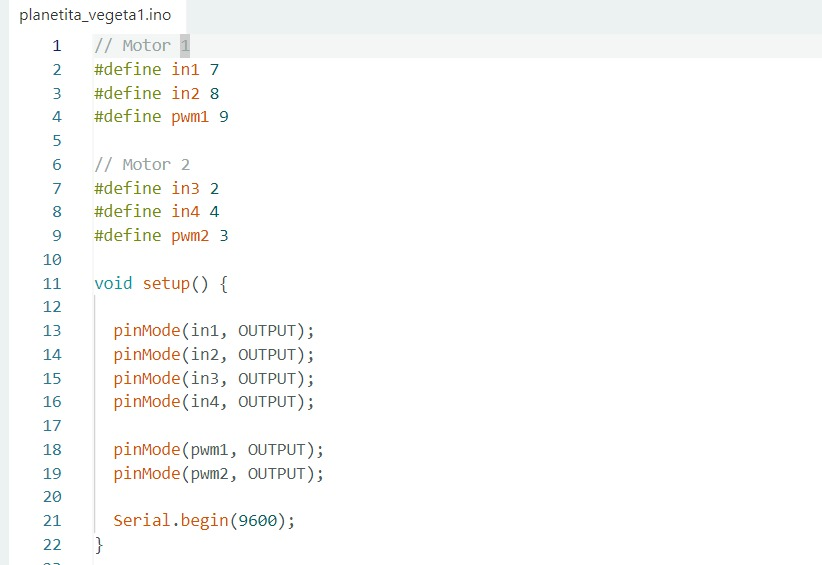{loading=lazy}
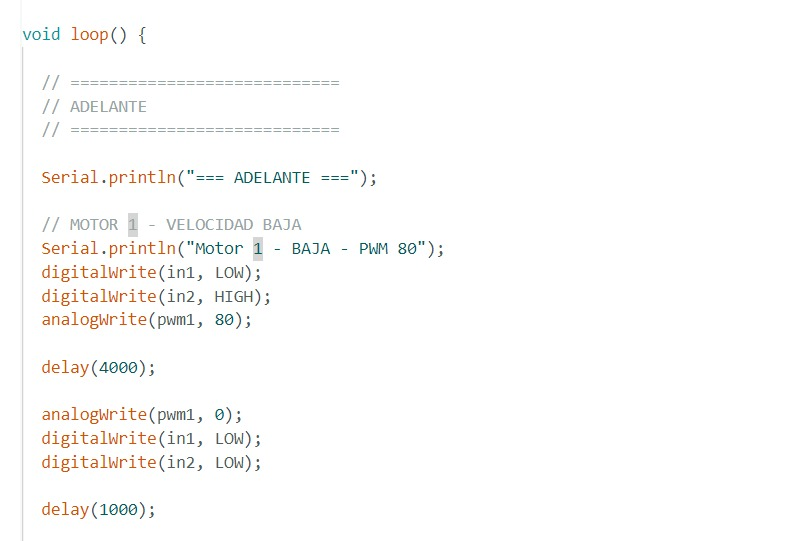{loading=lazy}
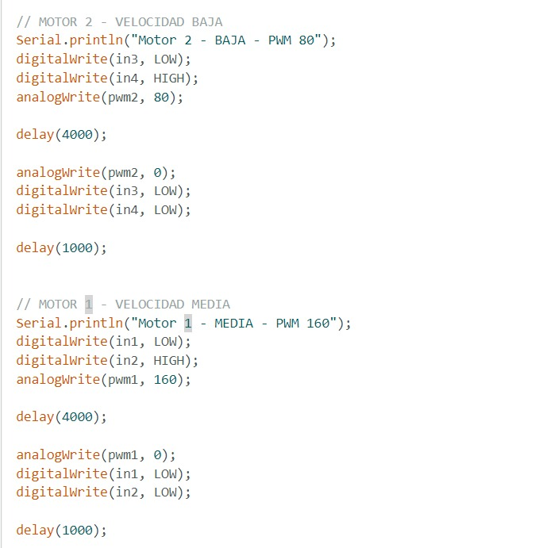{loading=lazy}
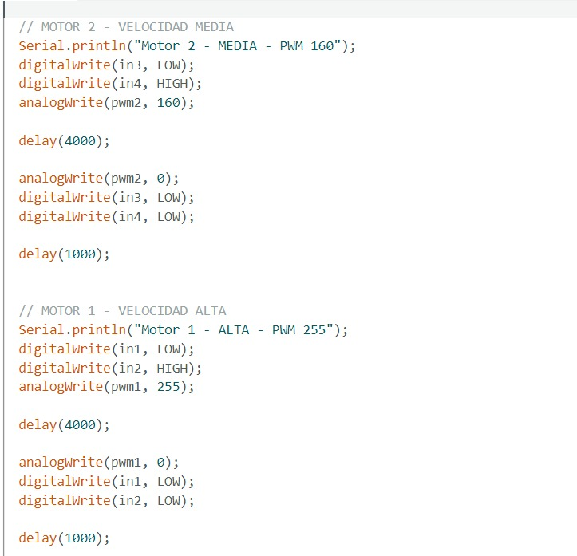{loading=lazy}
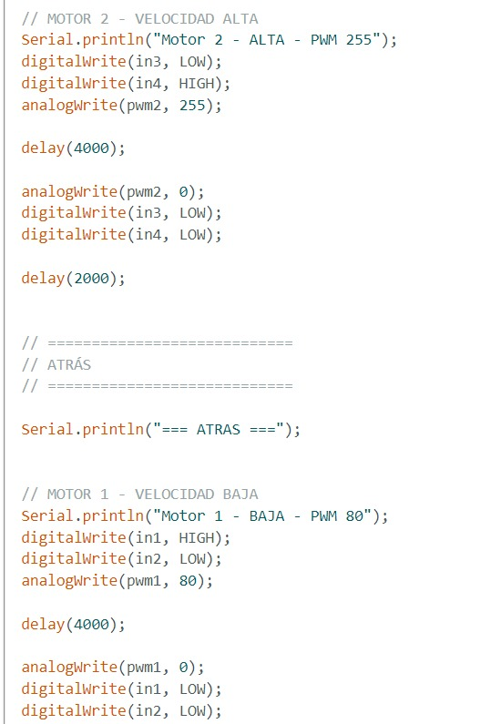{loading=lazy}
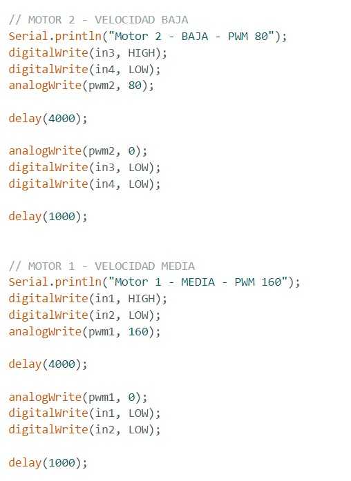{loading=lazy}
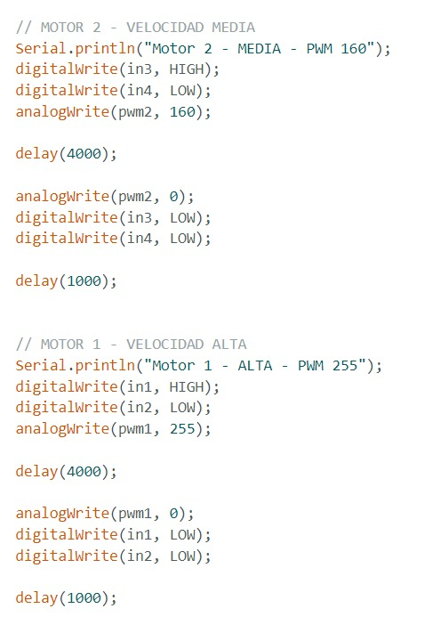{loading=lazy}
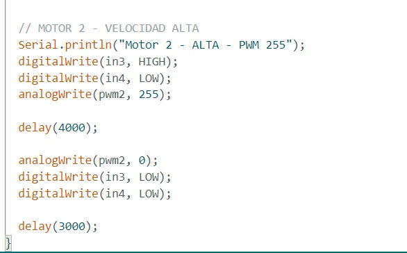{loading=lazy}

---

### Evidencia 2. Código de servomotores

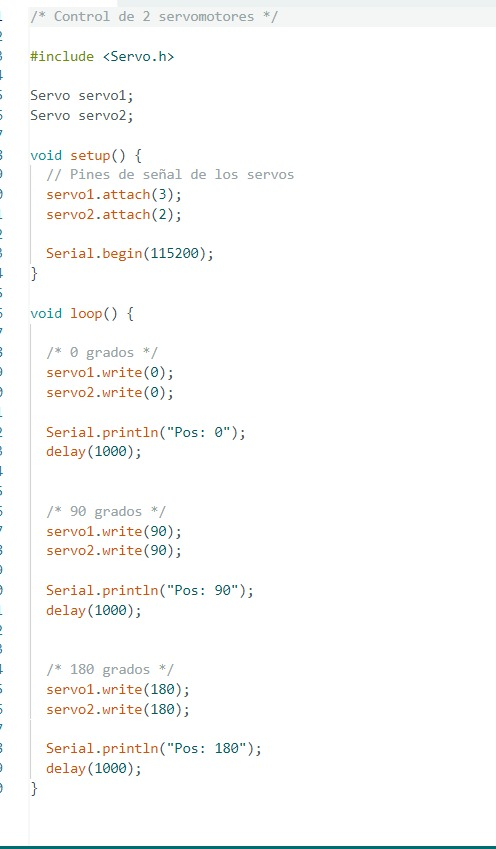{loading=lazy}

---

### Evidencia 3. Esquemático del circuito

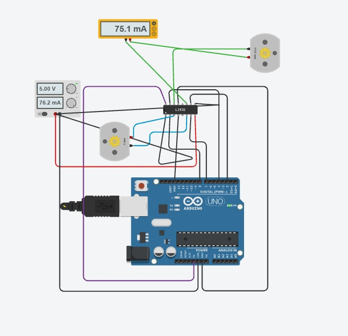{loading=lazy}
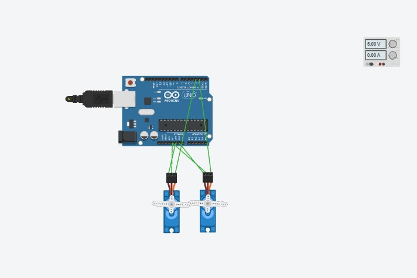{loading=lazy}

---

### Evidencia 4. Funcionamiento de los motores DC

---

### Evidencia 5. Funcionamiento de los servomotores

---

## 10. Resumen de Resultados

| Parámetro | Resultado |
|:---|:---:|
| PWM mínimo de arranque | ≈ 70 |
| PWM velocidad baja | 80 |
| PWM velocidad media | 160 |
| PWM velocidad alta | 255 |
| Corriente de arranque | ≈ 120 mA |
| Corriente en giro libre | ≈ 75 mA |
| Posición mínima del servo | 0° |
| Posición media del servo | 90° |
| Posición máxima del servo | 180° |
| Duty a 0° | 5 % |
| Duty a 90° | 7.5 % |
| Duty a 180° | 10 % |

*Se uso IA para darle formato y un tono mas formal a la practica*