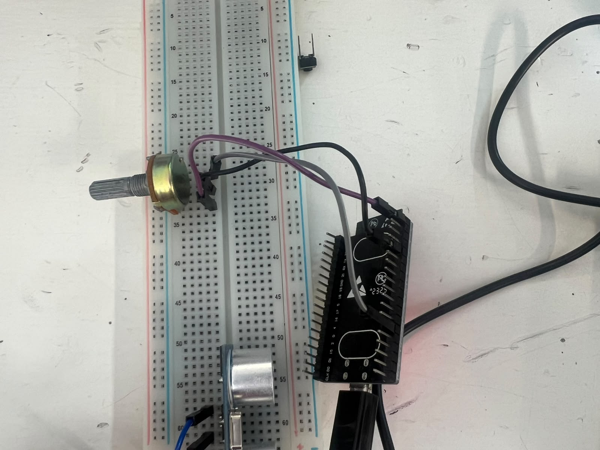
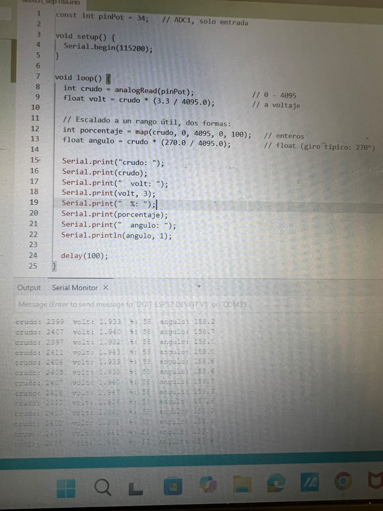

**Universidad Iberoamericana Puebla**  
**Materia:** Introducción a la Mecatrónica  
**Tema:** Sensores 
**Periodo:** Otoño 2026
---

## 1. Introducción

En esta práctica trabajamos con un ESP32 para leer información de diferentes sensores. Utilizamos un potenciómetro y un sensor ultrasónico, con los cuales pudimos obtener valores digitales y relacionarlos con variables físicas como el ángulo y la distancia.

La práctica nos ayudó a entender cómo el ESP32 recibe las señales de los sensores y cómo podemos convertir esas lecturas en valores que sean más fáciles de interpretar.
---

## 2. Objetivos

### Potenciómetro

- Realizar la lectura del potenciómetro usando el ADC del ESP32.
- Convertir la lectura a porcentaje.
- Convertir la lectura a un ángulo.
- Comparar la posición del potenciómetro con los valores obtenidos.

### Sensor ultrasónico

- Medir distancias utilizando el sensor ultrasónico.
- Realizar mediciones colocando un objeto a diferentes distancias.
- Comparar las distancias reales con las obtenidas por el sensor.
- Calcular el error de las mediciones.
---

## 3. Materiales

- ESP32 DevKit V1
- Potenciómetro de 10 kΩ
- Sensor ultrasónico HC-SR04
- Protoboard
- Cables jumper
- Computadora
- Arduino IDE
---

## 4. Fundamento teórico

### ADC del ESP32

El ESP32 utiliza un convertidor analógico-digital (ADC) para transformar una señal de voltaje en un valor digital. En este caso, la lectura puede ir de 0 a 4095 debido a que se utiliza una resolución de 12 bits.

La conversión de la lectura del ADC a voltaje se puede representar como:

`V = (lectura / 4095) × 3.3`

Esto permite que el ESP32 pueda interpretar una señal analógica como un valor numérico.

### Potenciómetro

El potenciómetro es un resistor variable. Al girarlo, cambia el voltaje que llega a la entrada analógica del ESP32. Dependiendo de la posición en la que se encuentre, se obtiene una lectura diferente en el ADC.

La lectura se convirtió a porcentaje utilizando:

`Porcentaje = (ADC / 4095) × 100`

También se convirtió la lectura a un ángulo de 0° a 270°:

`Ángulo = (ADC / 4095) × 270`

### Resultados del potenciómetro

| Punto | Ángulo de referencia (°) | Lectura ADC | Ángulo calculado (°) | Error (°) |
|---|---:|---:|---:|---:|
| Mínimo | 0 | 18 | 1.19 | 1.19 |
| 25 % | 67.5 | 1018 | 67.05 | 0.45 |
| 60 % | 162 | 2399 | 158.20 | 3.80 |
| 75 % | 202.5 | 3067 | 202.22 | 0.28 |
| Máximo | 270 | 4080 | 268.99 | 1.01 |

En una de las mediciones se obtuvo una lectura ADC de 2399, que corresponde aproximadamente al 60 % del recorrido del potenciómetro. El ángulo calculado fue de aproximadamente 158.2°.

El error se calculó mediante:

`Error = |Ángulo de referencia - Ángulo calculado|`

{loading=lazy}
{loading=lazy}

### Sensor ultrasónico

El sensor ultrasónico HC-SR04 se utilizó para medir la distancia entre el sensor y un objeto. El sensor manda una señal mediante el pin `TRIG` y recibe el rebote mediante el pin `ECHO`.

El ESP32 mide cuánto tiempo tarda la señal en regresar y utiliza ese tiempo para calcular la distancia:

`Distancia = (tiempo × velocidad del sonido) / 2`

Se divide entre dos porque la señal realiza un recorrido de ida y vuelta.

### Resultados del sensor ultrasónico

| Medición | Distancia de referencia (cm) | Distancia medida (cm) | Error (cm) |
|---|---:|---:|---:|
| 1 | 10 | 10.3 | 0.3 |
| 2 | 20 | 19.7 | 0.3 |
| 3 | 30 | 30.5 | 0.5 |
| 4 | 40 | 39.4 | 0.6 |
| 5 | 50 | 50.8 | 0.8 |

Los resultados muestran que las mediciones del sensor fueron bastante cercanas a las distancias de referencia. Sin embargo, hubo pequeñas diferencias debido a factores como la posición del objeto, el rebote de las ondas ultrasónicas y posibles variaciones en la lectura del sensor.

El error se calculó mediante:

`Error = |Distancia de referencia - Distancia medida|`
---

## 5. Código utilizado

{loading=lazy}

---

## 6. Conclusion
Con esta práctica pudimos ver cómo el ESP32 puede recibir información de diferentes sensores y convertirla en datos que podemos interpretar. Con el potenciómetro relacionamos la lectura del ADC con un porcentaje y un ángulo, mientras que con el sensor ultrasónico pudimos medir diferentes distancias.

Los resultados fueron bastante cercanos a los valores de referencia, aunque se presentaron pequeños errores en las mediciones. Esto nos permitió entender mejor cómo funcionan los sensores y cómo el ESP32 procesa sus señales

*Se uso IA para darle formato y un tono mas formal a la preactica*