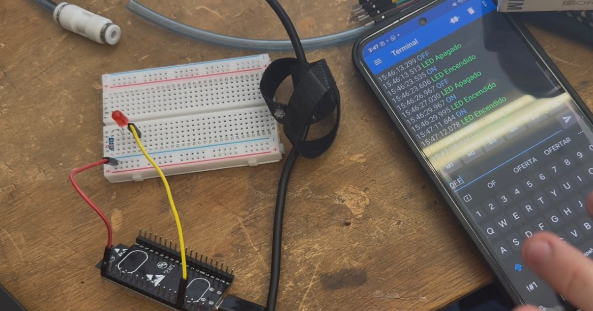
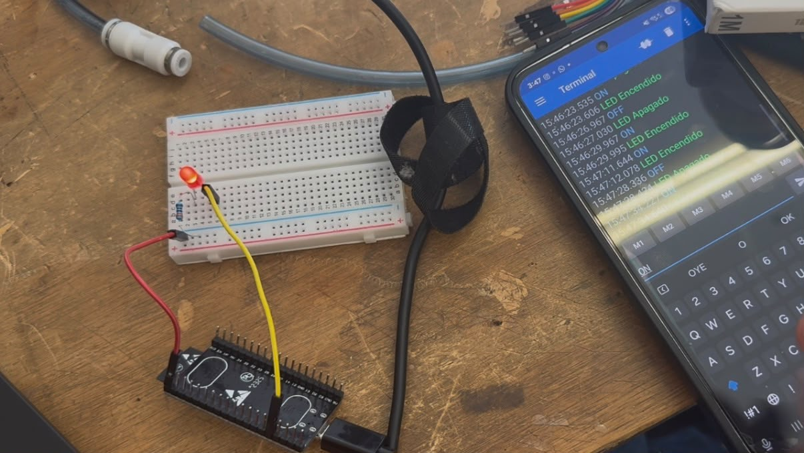

# Reporte de Práctica: LED con Bluetooth

**Universidad Iberoamericana Puebla**  
**Materia:** Introducción a la Mecatrónica  
**Tema:** Bluetooth — LED con Bluetooth  
**Periodo:** Otoño 2026

---

## 1. Metas y propósitos de la práctica

### Objetivo

El objetivo de esta práctica fue aprender a utilizar el Bluetooth del ESP32 para controlar un LED desde un teléfono Android. Para lograrlo, enviamos comandos desde una aplicación de terminal Bluetooth y observamos cómo respondía el LED al recibir las instrucciones.

También buscamos entender mejor cómo funciona la comunicación inalámbrica y comprobar cómo un retraso de tiempo puede afectar la respuesta del sistema.

## 2. Componentes y materiales utilizados

| Cantidad | Componente |
|---|---|
| 1 | ESP32 |
| 1 | LED |
| 1 | Protoboard |
| Varios | Cables jumper |
| 1 | Cable USB |
| 1 | Teléfono Android |
| 1 | Aplicación de terminal Bluetooth |
| 1 | Computadora con Arduino IDE |

**Importante:** Para realizar la práctica utilizamos un teléfono Android, ya que fue el dispositivo empleado para conectarnos al ESP32 y enviar los comandos desde la aplicación de terminal Bluetooth.

## 3. Desarrollo de la práctica

Primero, preparamos el ESP32 y conectamos el LED al pin GPIO 23, que fue el que utilizamos para controlar su encendido y apagado. Después, conectamos la tarjeta a la computadora mediante un cable USB y cargamos el programa desde Arduino IDE.

Para establecer la comunicación inalámbrica, utilizamos la librería `BluetoothSerial.h`. También asignamos al ESP32 el nombre **ESP32_LED**, para poder identificarlo fácilmente al buscar dispositivos Bluetooth disponibles.

Después, utilizamos un teléfono Android para emparejarlo con el ESP32. Una vez que se estableció la conexión, abrimos la aplicación de terminal Bluetooth y comenzamos a enviar los comandos necesarios para controlar el LED.

Cuando enviábamos el comando `ON`, el ESP32 cambiaba el estado del GPIO 23 a `HIGH`, haciendo que el LED se encendiera. En cambio, al enviar `OFF`, el pin cambiaba a `LOW` y el LED se apagaba.

Además, programamos el ESP32 para que enviara una respuesta al teléfono después de ejecutar cada comando. De esta manera, podíamos saber si el LED se había encendido o apagado. Si enviábamos un comando diferente, el sistema respondía con un mensaje indicando que el comando era incorrecto.

También utilizamos la función `trim()` para eliminar espacios y caracteres adicionales que pudieran afectar la lectura de los comandos. Por último, incluimos una opción para agregar un retraso de un segundo y observar cómo cambiaba el tiempo de respuesta del sistema.

## 4. Código utilizado

{loading=lazy}

## 5. Resultados y observaciones

Durante la práctica logramos establecer la conexión Bluetooth entre el teléfono Android y el ESP32. Después de emparejar los dispositivos, pudimos enviar comandos desde la aplicación y comprobar que el LED respondía correctamente.

Al enviar `ON`, el LED conectado al GPIO 23 se encendía, mientras que con el comando `OFF` se apagaba. También comprobamos que el ESP32 enviaba un mensaje de confirmación al teléfono después de ejecutar cada instrucción.

Otro aspecto importante fue utilizar un teléfono Android para realizar la conexión y trabajar con la aplicación de terminal Bluetooth que empleamos durante la actividad.

Por último, revisamos el efecto de agregar un retraso de un segundo. Esto nos permitió entender que el tiempo de espera dentro del programa puede hacer que el sistema tarde más en responder a los comandos. Así pudimos relacionar lo que vimos en el código con el comportamiento del circuito.

{loading=lazy}
{loading=lazy}

## 6. Conclusión

Con esta práctica aprendimos a utilizar la comunicación Bluetooth del ESP32 para controlar un LED de forma inalámbrica desde un teléfono Android. También comprendimos cómo enviar y recibir mensajes, utilizar comandos para controlar una salida digital y comprobar que las instrucciones se ejecutaran correctamente.

Además, observamos que agregar un retraso al programa puede afectar el tiempo de respuesta. Esto nos ayudó a entender la importancia de considerar los tiempos de ejecución al programar un sistema electrónico.

En general, la práctica nos permitió aplicar lo aprendido en clase y conocer una forma sencilla de controlar componentes electrónicos sin necesidad de conectarlos directamente a un dispositivo de control mediante cables de comunicación.
