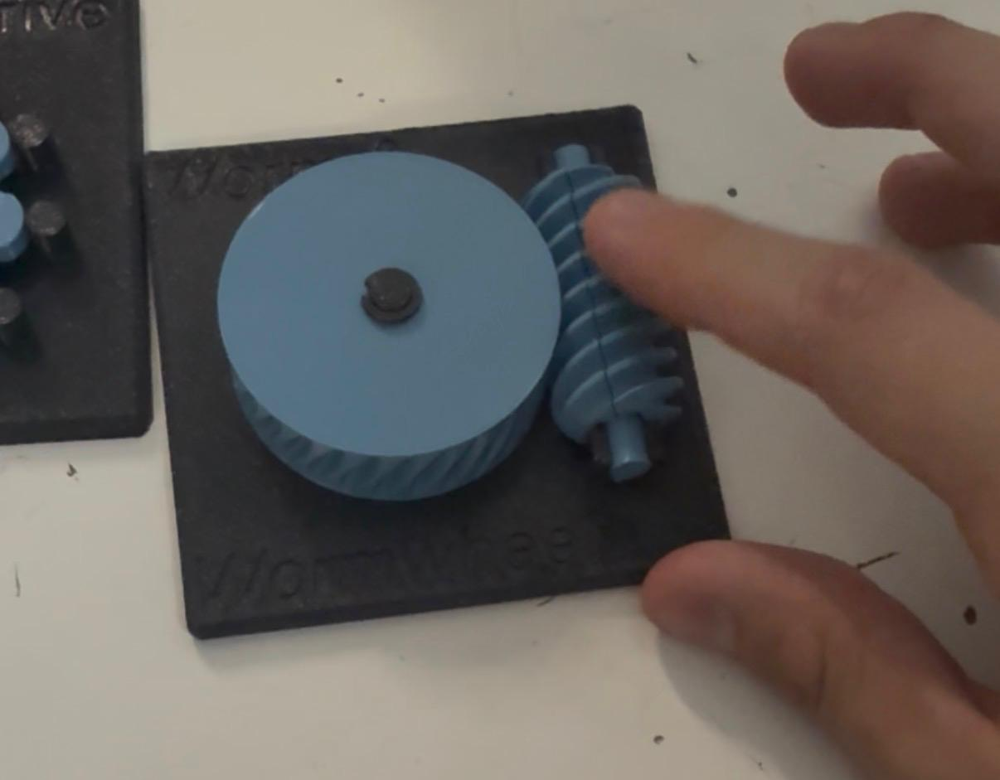
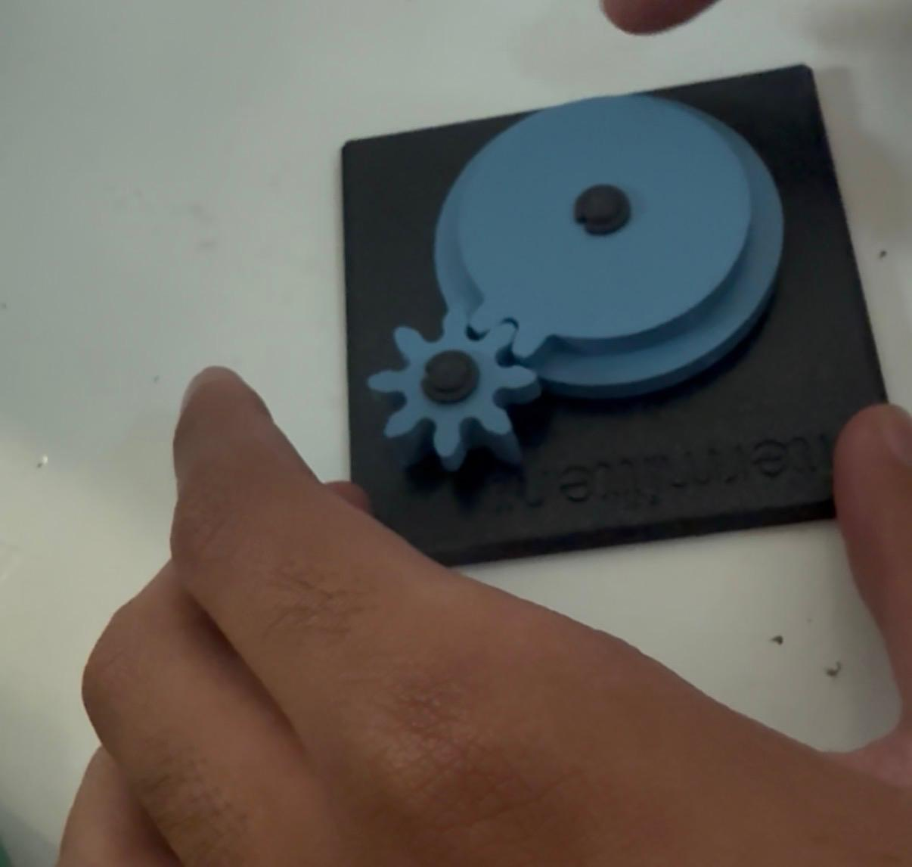
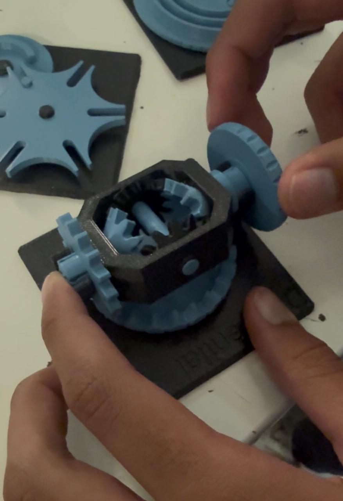
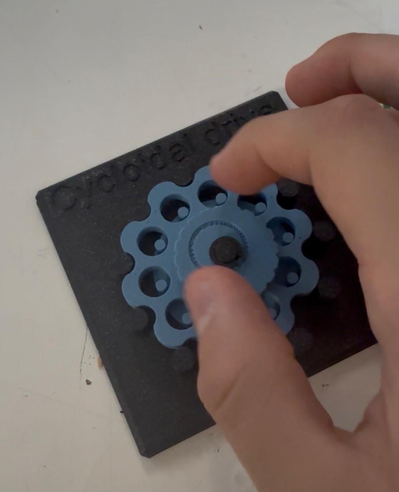
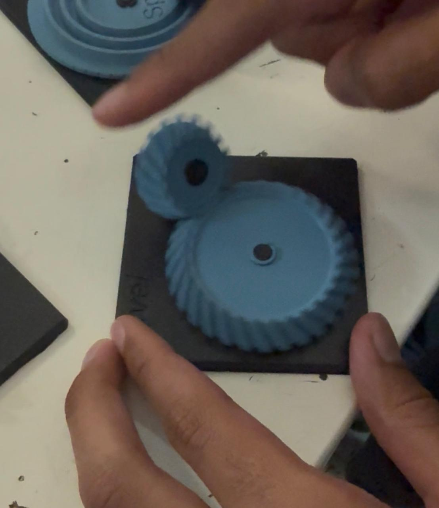
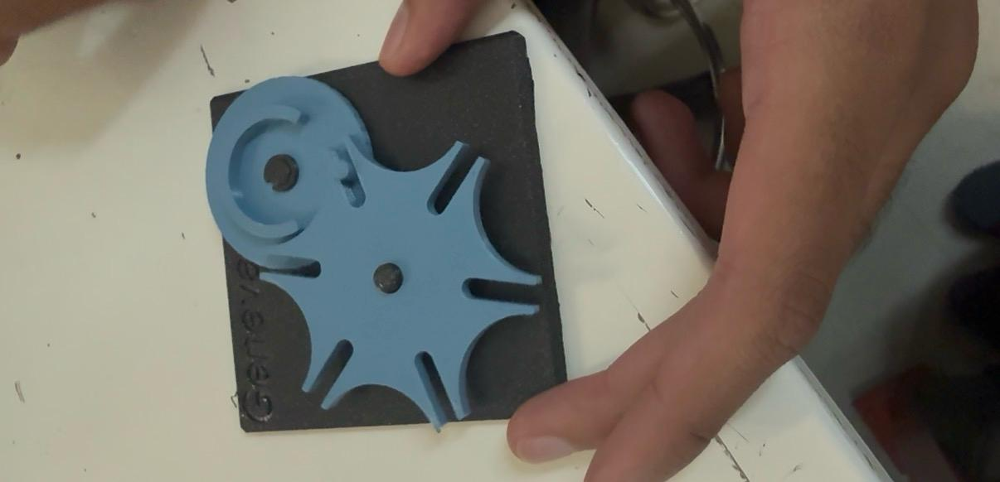
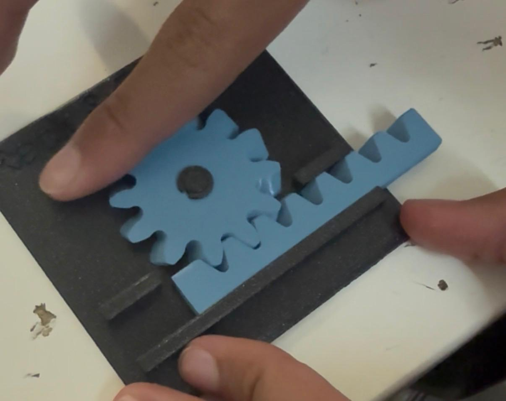
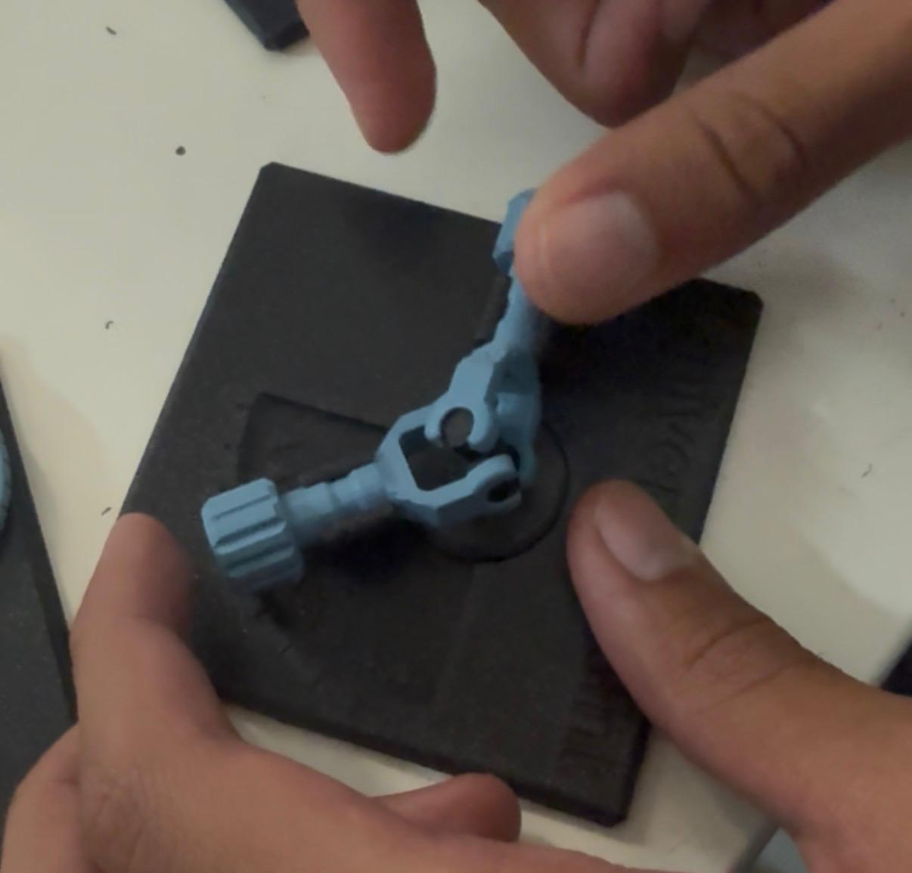

# Reporte de Práctica: Mecanismos

**Universidad Iberoamericana Puebla**  
**Materia:** Introducción a la Mecatrónica  
**Tema:** Mecanismos — Transformación y transmisión de movimiento  
**Periodo:** Otoño 2026  

---

## 1. Metas y propósitos de la práctica

### Objetivo

En esta práctica trabajamos con diferentes mecanismos para observar cómo transforman el movimiento. Giramos cada uno manualmente y analizamos qué pasaba con la salida, por ejemplo, si cambiaba la velocidad, la dirección del giro o si el movimiento se convertía en desplazamiento lineal.

También estimamos sus relaciones de transmisión y comprobamos si podían girarse en ambos sentidos. Finalmente, relacionamos cada mecanismo con ejemplos de la vida real y posibles usos en un carro o en algún proyecto propio.

## 2. Objetivos específicos

- Identificar los ocho mecanismos y observar cómo funcionan.
- Reconocer qué tipo de movimiento transforma cada uno.
- Estimar su relación de transmisión contando dientes o vueltas.
- Comprobar si los mecanismos son reversibles o autobloqueantes.
- Identificar aplicaciones prácticas para cada mecanismo.

## 3. Componentes y materiales utilizados

| Cantidad | Componente / Material |
| -------- | --------------------- |
| 8        | Mecanismos impresos en 3D |
| 1        | Tabla de registro para anotar las observaciones |
| 1        | Celular para tomar fotografías y grabar videos |

**Importante:** No fue necesario utilizar electricidad ni componentes electrónicos, ya que todos los mecanismos se accionaron manualmente.

## 4. Desarrollo de la práctica

Primero, recorrimos las estaciones e identificamos cada mecanismo. Después, giramos la pieza de entrada y observamos cómo se movía la salida para entender qué función realizaba.

También contamos dientes o vueltas para estimar la relación de transmisión. Por ejemplo, el mecanismo Intermitten avanzaba dos dientes por giro y completaba una vuelta en cuatro giros.

Después intentamos girar la salida en sentido contrario para comprobar si los mecanismos eran reversibles o autobloqueantes. En los modelos de la práctica fue posible girarlos en ambos sentidos.

Por último, registramos ejemplos de dónde se utilizan estos mecanismos y pensamos en posibles aplicaciones para un carro o un proyecto propio.

## 5. Resultados y observaciones

### Tabla de mecanismos

| Estación | Mecanismo | ¿Qué transforma? | Relación estimada | ¿Reversible o autobloqueante? | ¿Dónde lo hemos visto? | Posible aplicación |
| -------- | --------- | ---------------- | ----------------- | ----------------------------- | ---------------------- | ------------------ |
| A | Diferencial | Distribuye el giro a diferentes velocidades. | La corona gira cada dos vueltas. | Reversible | Carros | No se consideró útil para el proyecto actual. |
| B | Cicloidal | Reduce la velocidad y aumenta el par. | 10:1 | Reversible | Relojes | Reducir la velocidad de las ruedas. |
| C | Cardán | Transmite el giro entre ejes desalineados. | 1:1 | Reversible | Carros | Mover la barrera del carro para cambiar la dirección de empuje de la pelota. |
| D | Obturador | Convierte un giro pequeño en la apertura o cierre de un paso. | Se abre por completo con un cuarto de vuelta. | Reversible | Cámaras | Permitir el paso de objetos en otro proyecto. |
| E1 | Intermitten | Convierte el giro continuo en movimiento intermitente. | Dos dientes por giro; una vuelta completa en cuatro giros. | Reversible | Proyectores de cine | No se consideró útil para el proyecto actual. |
| E1 | Rack & Pinion | Convierte la rotación en movimiento lineal y viceversa. | Movimiento lineal continuo; relación aproximada 1:1 según el registro. | Reversible | Bicicletas | Mover una plataforma mediante engranes. |
| E2 | Worm | Cambia el eje de giro 90° y reduce la velocidad. | Varias vueltas del tornillo por cada vuelta de la rueda. | Reversible en el modelo de la práctica | Limpiaparabrisas de carros | No se consideró útil para el proyecto actual. |
| E2 | Bevel | Cambia el eje de giro 90° entre ejes que se cruzan. | 1:1 | Reversible | Taladros | No se consideró útil para el proyecto actual. |

{loading=lazy}
{loading=lazy}
{loading=lazy}
{loading=lazy}
{loading=lazy}
{loading=lazy}
{loading=lazy}
{loading=lazy}

### Observaciones principales

- **Reducción de velocidad:** El Cicloidal y el Worm reducen la velocidad y aumentan el par.
- **Cambio de eje:** El Cardán transmite el giro entre ejes desalineados, mientras que el Bevel cambia la dirección del giro 90°.
- **Movimiento intermitente:** El Intermitten avanza dos dientes por giro y completa una vuelta en cuatro giros.
- **Movimiento lineal:** El Rack & Pinion transforma el giro de un engrane en un desplazamiento en línea recta.
- **Apertura y cierre:** El Obturador se abre por completo con un cuarto de vuelta.

Algo interesante fue que el Worm de la práctica podía girarse en ambos sentidos debido a la inclinación de su espiral. En cambio, un tornillo sin fin real con una espiral menos inclinada puede ser autobloqueante, lo que significa que la rueda no puede hacer girar al tornillo.

Para el proyecto actual, el Cicloidal, el Cardán, el Obturador y el Rack & Pinion fueron los que identificamos con posibles aplicaciones. El Diferencial, el Intermitten, el Worm y el Bevel se consideraron menos útiles para nuestra idea.

## 6. Ejercicios
### 1. Tren simple

**Enunciado:** Un piñón de 10 dientes mueve un engrane de 40 dientes[cite: 1]. El motor entrega 300 rpm y 0.1 N·m[cite: 1]. ¿A qué velocidad y con qué par gira la salida? (Ignorar pérdidas por fricción.)[cite: 1]

### Datos:
* $Z_1 = 10 \text{ dientes}$[cite: 1]
* $Z_2 = 40 \text{ dientes}$[cite: 1]
* $n_1 = 300 \text{ rpm}$[cite: 1]
* $T_1 = 0.1 \text{ N}\cdot\text{m}$[cite: 1]

### Procedimiento:

1. **Relación de transmisión ($i$):**
   $$i = \frac{Z_1}{Z_2} = \frac{10}{40} = 0.25 \quad (\text{o relación } 1:4)$$

2. **Velocidad de salida ($n_2$):**
   $$n_2 = n_1 \cdot i = 300 \text{ rpm} \times 0.25 = 75 \text{ rpm}$$

3. **Par de salida ($T_2$):**  
   Dado que no hay pérdidas por fricción, la potencia se conserva ($P = T \cdot \omega$):
   $$T_2 = \frac{T_1}{i} = \frac{0.1 \text{ N}\cdot\text{m}}{0.25} = 0.4 \text{ N}\cdot\text{m}$$

### Resultado:
* **Velocidad de salida:** $75 \text{ rpm}$
* **Par de salida:** $0.4 \text{ N}\cdot\text{m}$

---

### 2. Tren compuesto

**Enunciado:** Dos etapas en serie: 12 $\rightarrow$ 36 dientes, seguida de 10 $\rightarrow$ 40 dientes[cite: 1]. ¿Cuál es la relación total?[cite: 1] Si la entrada gira a 960 rpm, ¿a qué velocidad gira la salida final?[cite: 1]

### Datos:
* **Etapa 1:** $Z_1 = 12$, $Z_2 = 36$[cite: 1]
* **Etapa 2:** $Z_3 = 10$, $Z_4 = 40$[cite: 1]
* $n_{\text{entrada}} = 960 \text{ rpm}$[cite: 1]

### Procedimiento:

1. **Relación de transmisión de cada etapa:**
   $$i_1 = \frac{Z_1}{Z_2} = \frac{12}{36} = \frac{1}{3}$$
   $$i_2 = \frac{Z_3}{Z_4} = \frac{10}{40} = \frac{1}{4}$$

2. **Relación total de transmisión ($i_{\text{total}}$):**
   $$i_{\text{total}} = i_1 \cdot i_2 = \frac{1}{3} \cdot \frac{1}{4} = \frac{1}{12} \quad (\text{o relación } 1:12)$$

3. **Velocidad de salida final ($n_{\text{salida}}$):**
   $$n_{\text{salida}} = n_{\text{entrada}} \cdot i_{\text{total}} = 960 \text{ rpm} \times \frac{1}{12} = 80 \text{ rpm}$$

### Resultado:
* **Relación total:** $1:12$ (ó $1/12 \approx 0.0833$)
* **Velocidad de salida final:** $80 \text{ rpm}$

---

### 3. Sinfín

**Enunciado:** Un sinfín de 2 hilos mueve una corona de 40 dientes[cite: 1]. (En un sinfín, $Z_1$ es el número de hilos.)[cite: 1] ¿Cuál es la relación de transmisión?[cite: 1] ¿Cuántas vueltas del sinfín se necesitan para una vuelta de la corona?[cite: 1]

### Datos:
* $Z_1 = 2 \text{ hilos}$[cite: 1]
* $Z_2 = 40 \text{ dientes}$[cite: 1]

### Procedimiento:

1. **Relación de transmisión ($i$):**
   $$i = \frac{Z_1}{Z_2} = \frac{2}{40} = \frac{1}{20} = 0.05 \quad (\text{relación } 1:20)$$

2. **Vueltas del sinfín por vuelta de la corona ($V_{\text{sinfín}}$):**
   $$V_{\text{sinfín}} = \frac{1}{i} = \frac{40}{2} = 20 \text{ vueltas}$$

### Resultado:
* **Relación de transmisión:** $1:20$ (ó $0.05$)
* **Vueltas del sinfín requeridas:** $20 \text{ vueltas}$

---

### 4. Cruz de Ginebra

**Enunciado:** Contar las ranuras de la cruz del laboratorio y calcular: grados que avanza por cada paso, y vueltas completas del impulsor necesarias para una vuelta completa de la cruz[cite: 1].

### Datos de referencia del laboratorio:
* **Número de ranuras ($N$):** $4 \text{ ranuras}$ *(caso estándar empleado en la práctica)*

### Procedimiento:

1. **Grados que avanza por cada paso ($\theta$):**
   $$\theta = \frac{360^\circ}{N} = \frac{360^\circ}{4} = 90^\circ$$

2. **Vueltas completas del impulsor para una vuelta completa de la cruz ($V_{\text{impulsor}}$):**
   Dado que cada vuelta del impulsor hace avanzar a la cruz exactamente $1$ paso (1 ranura):
   $$V_{\text{impulsor}} = N = 4 \text{ vueltas}$$

### Resultado:
* **Grados por paso:** $90^\circ$ *(para $N = 4$)*
* **Vueltas del impulsor por vuelta completa de la cruz:** $4 \text{ vueltas}$

---

### 5. Velocidad del carro

**Enunciado:** El motor TT tiene reducción interna 1:48 y, a 6 V, la rueda gira aproximadamente 200 rpm sin carga[cite: 1]. Con ruedas de 65 mm de diámetro, usando:[cite: 1]
$$v = \pi \cdot D \cdot \frac{\text{rpm}}{60}$$[cite: 1]
¿Cuál es la velocidad máxima teórica del carro en m/s?[cite: 1] ¿Por qué en el piso real será menor que ese valor teórico?[cite: 1]

### Datos:
* $D = 65 \text{ mm} = 0.065 \text{ m}$[cite: 1]
* $\text{rpm} = 200 \text{ rpm}$[cite: 1]

### Procedimiento:

1. **Cálculo de la velocidad teórica ($v$):**
   $$v = \pi \cdot 0.065 \text{ m} \cdot \frac{200}{60}$$
   $$v = \pi \cdot 0.065 \cdot 3.3333 = 0.68067 \text{ m/s} \approx 0.681 \text{ m/s}$$

2. **Justificación del valor real vs teórica:**
   En el piso real la velocidad será menor debido a:
   * **Fricción y rozamiento:** Fricción entre la rueda y la superficie del piso, así como la fricción mecánica interna en los ejes.
   * **Peso del vehículo (Carga):** Los 200 rpm son un dato *sin carga*; al agregar el chasis, baterías y motores, la carga reduce la velocidad angular efectiva del motor.
   * **Deslizamiento (Pérdida de tracción):** Pequeñas pérdidas de adherencia entre el caucho/plástico de la rueda y el suelo.

### Resultado:
* **Velocidad máxima teórica:** $\approx 0.681 \text{ m/s}$ (ó $68.1 \text{ cm/s}$)
* **Causa de reducción real:** Fricción, carga útil del peso del vehículo sobre los motores y deslizamiento de las ruedas.

---

### 6. Dirección diferencial

**Enunciado:** La rueda izquierda va a $0.4 \text{ m/s}$, la derecha a $0.6 \text{ m/s}$, y la separación entre ruedas es $L = 0.12 \text{ m}$[cite: 1]. Usando:[cite: 1]
$$v = \frac{v_{\text{der}} + v_{\text{izq}}}{2}, \quad \omega = \frac{v_{\text{der}} - v_{\text{izq}}}{L}, \quad R = \frac{v}{\omega}$$[cite: 1]
calcular la velocidad del centro del carro, su velocidad de giro, y el radio de la curva que describe[cite: 1].

### Datos:
* $v_{\text{izq}} = 0.4 \text{ m/s}$[cite: 1]
* $v_{\text{der}} = 0.6 \text{ m/s}$[cite: 1]
* $L = 0.12 \text{ m}$[cite: 1]

### Procedimiento:

1. **Velocidad del centro del carro ($v$):**[cite: 1]
   $$v = \frac{0.6 + 0.4}{2} = \frac{1.0}{2} = 0.5 \text{ m/s}$$

2. **Velocidad angular de giro ($\omega$):**[cite: 1]
   $$\omega = \frac{0.6 - 0.4}{0.12} = \frac{0.2}{0.12} = 1.6667 \text{ rad/s} \quad \left(\text{ó } \frac{5}{3} \text{ rad/s}\right)$$

3. **Radio de la curva ($R$):**[cite: 1]
   $$R = \frac{v}{\omega} = \frac{0.5}{1.6667} = 0.3 \text{ m}$$

### Resultado:
* **Velocidad del centro ($v$):** $0.5 \text{ m/s}$
* **Velocidad de giro ($\omega$):** $1.67 \text{ rad/s}$
* **Radio de la curva ($R$):** $0.3 \text{ m}$ (ó $30 \text{ cm}$)

---

### 7. Diseño

**Enunciado:** Se busca que el carro sea el doble de "fuerte" para empujar la pelota en el torneo, aceptando ir a la mitad de velocidad[cite: 1]. Proponer una relación de engranes adicional entre motor y rueda, y calcular la nueva velocidad máxima resultante[cite: 1].

### Datos:
* Factor de torque deseado: $\times 2$[cite: 1]
* Factor de velocidad deseado: $\times 0.5$[cite: 1]
* Velocidad máxima teórica previa ($v_{\text{original}}$): $0.681 \text{ m/s}$[cite: 1]

### Propuesta y Cálculo:

1. **Relación de engranes propuesta ($i_{\text{adicional}}$):**
   Para duplicar el par (fuerza) y reducir la velocidad a la mitad, se requiere una reducción adicional de **$1:2$** ($i_{\text{adicional}} = 0.5$).
   * **Ejemplo de engranes:** Un piñón motriz de **12 dientes** conectado a un engrane conducido de **24 dientes** ($12/24 = 1/2$).

2. **Nueva velocidad máxima resultante ($v_{\text{nueva}}$):**
   $$v_{\text{nueva}} = v_{\text{original}} \cdot i_{\text{adicional}}$$
   $$v_{\text{nueva}} = 0.681 \text{ m/s} \times 0.5 = 0.3405 \text{ m/s}$$

### Resultado:
* **Propuesta de engranes:** Reducción $1:2$ (por ejemplo, piñón de $12$ dientes impulsando engrane de $24$ dientes).
* **Nueva velocidad máxima:** $\approx 0.341 \text{ m/s}$ (ó $34.1 \text{ cm/s}$)

## 7. Conclusión

Con esta práctica aprendimos cómo funcionan diferentes mecanismos y cómo cada uno puede cambiar el movimiento de una manera distinta. Al girarlos y contar sus dientes o vueltas, pudimos entender mejor sus relaciones de transmisión y comprobar si podían moverse en ambos sentidos.

Además, vimos que mecanismos que parecen sencillos tienen aplicaciones importantes en objetos cotidianos, como los carros, las cámaras y los taladros. Esto nos ayudó a identificar cuáles podrían ser útiles para nuestros propios proyectos de mecatrónica.